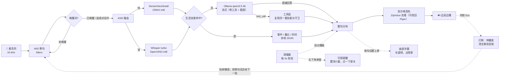

# 本地语音到语音助手（全离线）

[](LICENSE)

**SenseVoiceSmall / Whisper-large-v3-turbo → Ollama qwen3.5:4b → 凯尔希音色（ZipVoice 零样本克隆，可一行改回 Piper）**

完全跑在本机的「说话 → 识别 → 思考 → 说话」闭环，不联网、不上传任何数据。
支持唤醒词常驻待命、闹钟与会议提醒、备忘、日程查询，并且边说边播（首音 1~2 秒）。

---

## 这份 README 里有什么

**这里只讲怎么装、怎么用。** 所有「为什么这么设计」「实测多少」「踩过什么坑」
都在 [`docs/ENGINEERING_LOG.md`](docs/ENGINEERING_LOG.md)（工程日志，1300+ 行实测记录）。

| 想干什么 | 去哪看 |
| --- | --- |
| 装起来、跑起来 | 下面第 3 节「安装」、第 4 节「使用」 |
| 改配置 / 改唤醒词 / 加事件 | 第 5 节「两个可配置的 json」 |
| 加一个角色 / 换音色 / 训专属声线 | 第 14 节「角色设定」 |
| 出问题了 | 第 8 节「常见问题」 |
| **为什么是这么设计的、实测数字、踩坑记录** | **[`docs/ENGINEERING_LOG.md`](docs/ENGINEERING_LOG.md)** |

---

## 1. 架构



### 1.1 两级加载（`listen` 常驻服务）

| 状态 | 加载了什么 | 内存 |
| --- | --- | --- |
| **待唤醒**（平时） | Silero VAD + SenseVoiceSmall | **约 0.9 GB** |
| **已唤醒**（加载） | 前台加载 TTS，后台预热 Whisper 与 qwen3.5:4b | 约 2.5 GB + Ollama |
| **空闲超时**（回收） | 卸载 Whisper / TTS，并让 Ollama 释放模型 | 回到 0.9 GB |

### 1.2 技能 / 工具 / 模型怎么分工

一句话：**模型**负责「听懂要干什么、该用哪个工具」，**确定性代码**负责「算时间、查数据、做守卫」。

```
你说 ──▶ ① 模型（带着 8 个工具，流式）
           ├ tool_call  → ② MCP 工具层（宿主 → 服务器）
           │               └ 算日期、去重、反问确认全在服务器后面的确定性代码里
           │               → 工具产出的话直接播报（不再多跑一轮模型）
           └ 直接回答   → 闲聊/百科，边说边播（中位 3~4 s）

（模型一个工具都没调、而这句话又明显要动手时）
        └──▶ ③ 兜底：正则技能层 → 命中就念它的话（模型那句不念）
```

③ 那一层是按 **MCP 协议自己搭的**（见第 13 节）：能力域拆成服务器，
宿主只负责「工具名 → 谁提供」，所以以后加能力域不用改 pipeline。

为什么是「模型先」而不是「正则先」（`[llm] route`，2026-09-19 改的）：

| | 结论 |
| --- | --- |
| 正则先行的代价 | 说法没覆盖到就**根本轮不到模型**。实测一天里踩了三次：「取消明天早上的安排」被当成删日程（把 9/23 的见面删了）、「我说是今晚 8 点 45」落到模型手里只嘴上说改了、「8点45」的分钟被丢掉 |
| 模型会不会选工具 | **会**：`scripts/eval_router.py --builtin` 29 句「该调哪个工具 / 该不调」**29/29 全对**，误报 0、漏调 0 |
| 模型能不能算日期 | **不能**：「下周三下午三点半」算成 10-04，「每周四」把 repeat 丢了、地点也丢。所以工具**只收用户原话**（`text`），解析交给 `nlp_time` |
| 模型会不会改写原话 | **会改写**（23 次调用里 6 次），两种都见过：丢了时间（「下周三下午三点半跟导师见面」→「跟导师见面」）、丢了动词（「提醒我明天早上七点练琴」→「明天早上七点练琴」，于是回了一句「这个提醒我没定上」）。所以参数过一道**机械校验**：丢了时间或丢了动宾词就换回原话；`fix_last` 一律用原话（实测它把「十点」改写成「8点45」） |
| 紧接着说一个时间 | **不会是新建**：刚记下一条（3 分钟内）而这一句是「纯时间」（「我说是今晚十点」）时，就算模型选了新增工具（`add_event`），也机械地改走 `fix_last`（改上一条）。——实测不管提示怎么写，模型都会选新增，结果响两次 |
| 闲聊会不会变慢 | 不会多一圈：模型带着工具也是**一次调用**，不要工具就直接答（中位 3~4 s） |
| 「看起来要动手」的那句 | 这句话的回答先**攒着不念**，等模型决定完：它没调工具就让技能层兜底（念技能那向，不念模型那句）。代价：这类句子的首音 = 首字（不再边生成边播） |
| 看图这种模型做不到的 | 也靠兜底：模型看不到你的屏幕，话里带「看看/桌面」就会被攒住，交给技能层去拍/截图 |
| 怎么知道刚才走了哪条路 | 每轮都打 `[路由 model / 工具 add_event(...)]`；兜底是 `model→skills`，老行为是 `rules→skills` |

> 想让正则先（省那几秒、或者模型换小了撑不住）：`[llm] route = "rules"`。
> 想完全不调工具：`[llm] router = "chat"`（这时自动走 `rules`）。
> 想自己量一遍选工具准不准：`python scripts/eval_router.py --builtin`（带预期标注，会算选对率）。

工具只有 8 个，都只收一句原话（`text`）：
`list_events`（事件列表，也接「有哪些提醒」）`next_event` `add_event` `change_event`
`list_memos` `add_memo`、`now`（报时）、`fix_last`（「我说是…」改刚记下那条）。

> ★合并前是 11 个★：`add_schedule`/`add_alarm` 是一回事，`change_schedule`/`cancel_alarm`
> 是一回事，`list_schedule`/`list_alarms` 也是一回事。现在**一条事件只有一个入口**。
> 工具内部还得防“说反了”：`change_event` 只在句子里真有「取消/删/改」类词时才动手，
> 带取消词却没对上就回「没找到」——绝不落到「新建」上去
> （实测说「取消今晚十点的闹钟」而库里没有那条时，会凭空多出一条 what=「取消」的闹钟）。

> 模型偶尔会把工具调用**写成一段 JSON 文字**（小模型常见毛病）。
> 这种文字绝不会被念出来：会被拦下来，能抢回就当工具调用，抢不回就只记日志。
> 另外：`TOOL_HINT` 那几句话必须**紧贴在用户那句前面**（不是放在人设前面）——
> 实测放在最前面模型会当没看见，直接凭记忆答「下周有什么安排」。

实测日志：

```
[待唤醒] 请说「凯尔希」…
[已唤醒] 凯尔希。                          ← 1.6s 加载 TTS
你说：用一句话介绍杭州。
助手：杭州是个美丽的地方。  [首字 0.35s / 首音 1.25s]   ← 秒回
  Whisper 已就绪（后台加载 17.8s）           ← 后台加载，不阻塞对话
  LLM 已就绪（预热 0.1s）
  Whisper 已卸载，内存已释放                 ← 3 分钟无指令
  TTS 已卸载
[待唤醒] 已释放：Whisper、TTS、Ollama/qwen3.5:4b
```

关键设计：

| 位置 | 做法 | 原因 |
| --- | --- | --- |
| ASR | SenseVoice 快路径 + Whisper 按需复核 + 标点移植 | 中文短句 0.1s 出结果，长句/可疑结果才花 3s 让 Whisper 复核 |
| 意图 | **模型先选工具，正则技能层兜底** | 说法千变万化，正则只能盖住写过的那些（踩过：误删日程、纠正丢空）。模型选工具实测 29/29 全对，而算时间/守卫仍在代码里 |
| TTS 分块 | **只在句末切，短句合并** | Piper 中文音色看不到标点，切太碎会又平又顿（见工程日志「语调和断句」）；克隆后端更在意分块长短——它一段生成一次，每块都要等 |
| 播放 | 单独线程 + 队列，随时可打断 | 边生成边播，说错了**按 Esc 立刻停** |

## 2. 目录结构

```
<项目目录>\
├─ main.py                     # 入口：listen / stop / chat / text / ask / see / skills / asr / tts
│                              #       / devices / gpu / persona / mcp / selftest
├─ config.toml                 # 全部可调参数
├─ requirements.txt            # 依赖（Python 3.13）
├─ data/                       # ← 可以直接用编辑器改
│  ├─ characters.json          #   ★角色索引★：挂上谁（= 谁可被唤醒）+ 默认角色
│  ├─ personas/                #   ★独立人格文件★：一个角色一个 json（没挂上的不会被唤醒）
│  ├─ wakewords.json           #   唤醒词调参（唤醒词本身在人格文件里）
│  ├─ events.json              #   ★全部事件★：提醒 / 闹钟 / 课 / 会议 / 约会都是一条
│  └─ memos.json               #   备忘
├─ voice_loop/
│  ├─ pipeline.py              # 会话编排（唤醒服务、连续对话、打断、提醒播报）
│  ├─ wake.py                  # 唤醒词匹配（精确 + 别名 + 模糊）、「没事了」收回唤醒
│  ├─ events.py                # ★事件层★：一条事件的模型、发生时间引擎、到点判定、去重
│  ├─ event_text.py            # ★文字层★：一句人话 ↔ 一条事件（全项目只在这里写正则）
│  ├─ skills.py                # 生活技能：时间 / 事件 / 备忘 / 查询
│  ├─ settings.py              # config.toml → dataclass（含启动时校验与路径解析）
│  ├─ vision.py                # 看图：截屏 / 摄像头 / 剪贴板 / 找文件并抽取文本
│  ├─ persona.py               # ★角色设定：名字/背景/称呼/风格/示例台词 → system prompt
│  ├─ tools.py                 # 工具层：技能包成模型能调的工具（现在是 MCP 的一个服务器）
│  ├─ mcp/                     # ★ 自己搭的 MCP 架构（协议 / 服务器 / 客户端 / 宿主）
│  │  ├─ protocol.py           #   JSON-RPC 2.0 + MCP 消息形状
│  │  ├─ server.py             #   一个能力域 = 一个服务器（可 inproc 也可 stdio）
│  │  ├─ client.py             #   两种传输走同一套消息
│  │  ├─ host.py               #   聚合工具清单 + 白名单 + 路由 + 崩了重启
│  │  ├─ serve.py              #   python -m voice_loop.mcp.serve <服务器>
│  │  └─ servers/skills.py     #   技能服务器（见第 13 节）
│  ├─ scheduler.py             # 后台提醒调度器
│  ├─ system_ops.py            # 系统操作：关/开显示器（只关屏，不休眠）
│  ├─ bargein.py               # 语音自动打断（实验性、默认关）：分清「自己的回声」和「你在插话」
│  ├─ hotkey.py                # ★ 按 Esc 打断：裸按键监听，只在说话时读键盘
│  ├─ subtitle.py              # 底部半透明字幕（帮手里说的话都显示出来，跟声音同步）
│  ├─ toast.py                 # 右下角可视提醒弹窗
│  ├─ ui.py                    # Tk 窗口宿主（一个进程只能有一个 Tk 解释器）
│  ├─ nlp_time.py              # 中文时间解析（明天早上七点 / 十分钟后 / 下周三）
│  ├─ store.py                 # JSON 存储（外部改动自动重载、原子写入）
│  ├─ manifest.py              # 模型清单：该下哪些文件、对不对（download/check 共用）
│  ├─ text.py                  # LLM 输出清洗 + 流式分块 + 标点移植
│  ├─ audio.py                 # 麦克风、VAD、播放器
│  ├─ llm.py                   # Ollama 客户端（流式 + 工具 + 看图）
│  ├─ accel.py                 # 加速设备选择（核显 / NPU / CUDA → 每段用什么）
│  ├─ names.py                 # ★ 数值朗读：把 3810 念成「三千八百一十」
│  ├─ voice_data.py            # 角色声线素材：够不够、缺什么（persona_voice 用）
│  ├─ asr/                     # base.py（接口）/ sensevoice.py（快）/ whisper_ov.py（准）/ router.py
│  └─ tts/                     # base.py（接口）/ piper_tts.py（快）/ zipvoice_tts.py（音色克隆）
│                              # lazy.py（按需加载）/ pacing.py（停顿与断句）/ refclean.py（参考净化+去嘶声）
│                              # precision.py（int8/fp32 选哪份模型）
├─ scripts/
│  ├─ download_models.py       # 一键下载模型
│  ├─ test_offline.py          # 离线自测（分块/时间/技能/唤醒/生命周期，含 09-19 那次误解析误删的回归）
│  ├─ tts_clone_probe.py       # ★ 音色克隆试听/测速（生成 wav 供耳朵判断，可与 Piper 对比）
│  ├─ test_tts_clone.py        # ★ 克隆后端测试（--full 会真的加载模型跑一句）
│  ├─ import_lines.py          # ★ 把「名字+文本」清单导进角色的 lines（只添加，不替换）
│  ├─ test_import_lines.py     # ★ 导入程序测试（两种排版 / 去重 / 过滤 / 自动找 json / 备份）
│  ├─ prepare_tts_dataset.py   # ★ 素材 → 训练数据集（24 kHz + TSV）
│  ├─ test_prepare_dataset.py  # ★ 数据集那一步的测试（切分 / 音量 / 文本清洗 …）
│  ├─ finetune_zipvoice.py     # ★ 分步微调（--stage 1..8）：数据 → 训练 → 导出 → 安装 → 写 voice_model
│  ├─ persona_voice.py         # ★ 一条龙：--list/--dry-run/--verify，把上面几步串起来
│  ├─ test_voice_model.py      # ★ 角色语音模型的选择与降级（按角色 / 按精度 / 缺了就回退）
│  ├─ test_skills_route.py     # 技能路由 + 关屏 + 课表 + 提醒文案 + 重启不丢数据
│  ├─ test_bargein.py          # ★ 打断：合成对照 + 真机回声自测（--echo）/ 回环（--live）
│  ├─ test_hotkey.py           # ★ 按 Esc 打断：只在说话时读、丢掉积压按键、不吞 Ctrl+C
│  ├─ test_wake_cycle.py       # ★ 待机→唤醒→空闲回收→再次唤醒（含 Whisper 竞态）
│  ├─ test_subtitle.py         # ★ 字幕：可见性 / 居中 / 点得穿 / 说话期间不隐藏 / 自动隐藏（--check）
│  ├─ test_subtitle_sync.py    # ★ 字幕与语音同步：只显示念到的部分、段内插值不越界
│  ├─ test_trim_pacing.py      # ★ 停顿裁剪与断句节奏（模拟 + 离线，不出声）
│  ├─ test_names.py            # ★ 数值/符号念法（3810 → 三千八百一十，版本号、百分比…）
│  ├─ test_toast.py            # 看一眼右下角可视提醒长什么样
│  ├─ test_dialog.py           # 对话链路自测（不用麦克风）
│  ├─ bench_llm.py             # ★ 换模型前的体检（延迟 / 是否思考 / 看图识字）
│  ├─ eval_router.py           # ★ 模型选工具的准确率（带预期标注算选对率，--model 换模型对比）
│  ├─ test_tools.py            # 工具层自测（--live 走真模型）
│  ├─ test_route.py            # ★ 路由顺序：模型先选工具 / 技能兜底 / 参数换回原话（不联网）
│  ├─ test_mcp.py              # ★ MCP：协议 / 真管道 stdio / 白名单 / 路由 / 接进 pipeline
│  ├─ test_persona.py          # ★ 角色：结构化人设 / 多角色唤醒归属 / 切换 / 热重载
│  ├─ test_vision.py           # 看图自测（编图 / 找文件 / 识别）
│  ├─ test_accel.py            # 加速设备选择（核显 / NPU / 回退）
│  ├─ test_wake.py             # ★ 唤醒词实测与调优（打印听到的内容 / --apply 写进对应角色）
│  ├─ test_wake_apply.py       # ★ 唤醒词 --apply 写对文件了吗（纯离线，不碰麦克风）
│  ├─ test_mic_loopback.py     # 麦克风回环诊断（放一段语音，看能不能听到 + 识别）
│  ├─ clean_junk_data.py       # 清理早期版本写坏的数据（备忘「录吗？」、事件标题「我」这类）
│  ├─ check_deploy.py          # ★ 搬家/换系统前的只读自检（七类问题 + 怎么办）
│  ├─ pick_voice_ref.py        # ★ 声线体检：毛不毛先看参考/素材，附参考候选与 2×2 交叉
│  ├─ migrate_events.py        # ★ 把旧的 alarms+schedule 迁成统一事件表（**已迁完**，留着给历史数据）
│  ├─ test_events.py           # ★ 事件层测试（发生时间 / 二维去重 / 到期 / 事件链 / 迁移）
│  ├─ test_event_text.py       # ★ 文字层测试（一句话 ↔ 一条事件：标题 / 提前量 / 工作日 / 纯闹钟）
│  ├─ probe_npu.py             # ★ NPU 到底值不值得用（分阶段实测，含核显对照）
│  ├─ ab_clone_model.py        # ★ 声线 A/B：精度×步数的客观指标 + 试听 wav
│  ├─ test_precision.py        # ★ 精度（int8/fp32）与平台降级的离线测试
│  ├─ test_refclean.py         # ★ 参考净化 / 输出去嘶 / 电平对齐 / 压长停顿（纯离线）
│  ├─ ab_voice.py              # ★ 音质 A/B：沙沙声与语气连贯，配对多遍 + 写试听 wav
│  ├─ say.py                   # 用扬声器念一句话（不想开口时测唤醒词用）
│  └─ tts_probe.py             # TTS 调音工具（含语调对比）
├─ docs/
│  └─ ENGINEERING_LOG.md       # ★ 工程日志：实测数据 / 踩坑记录 / 设计取舍（README 的后半段）
└─ models/                     # 模型权重（不进 git，见 models/README.md）
```

---

## 3. 安装

```powershell
cd <项目目录>
pip install -r requirements.txt -i https://pypi.tuna.tsinghua.edu.cn/simple
python scripts/download_models.py     # 补上 SenseVoice / Silero VAD / Piper 中文女声（约 300 MB）
python scripts/download_models.py --only zipvoice   # 可选：ZipVoice 音色克隆（约 156 MB；不装就退回 Piper）
ollama pull qwen3.5:4b                # 主模型：文本 + 看图 + 工具（3.4 GB）
python main.py selftest               # 10 项检查，全过就能用了
```

> **Whisper（高精度 ASR）的权重是导出来的，不是下载的**——`download_models.py` 不管它。
> 想让 `[asr] strategy = "hybrid"` 真的能复核，按下面这条导出一次（约 930 MB，要装
> `optimum-intel[openvino]`，`requirements.txt` 里已经有了）：
>
> ```powershell
> optimum-cli export openvino --trust-remote-code --model openai/whisper-large-v3-turbo `
>     --weight-format int8 --disable-stateful models/asr/whisper-large-v3-turbo-int8-ov
> ```
>
> 没导出也能跑：`selftest` 会提示缺哪个文件，运行时会一直用 SenseVoice 那条快路径
> （中文短句够用）。各模型分别多大见 [`models/README.md`](models/README.md)。

想让它能**读文件**（PDF），再补一行：

```powershell
pip install pypdf                 # 可选：读 PDF（Word 靠已装的 python-docx）
```

> **换了机器 / 换了系统，先跑一遍自检**（只读，几秒）：
>
> ```powershell
> python scripts/check_deploy.py            # 环境/依赖/配置路径/模型/服务/平台能力/磁盘 七项
> python scripts/check_deploy.py --json     # 给脚本或 CI 看
> python scripts/check_deploy.py --strict   # 连「警告」也算失败（做部署镜像时用）
> ```
>
> 它会把每个问题连「怎么办」一起说清楚（缺哪个包、哪条路径不对、当前系统会少哪个功能），
> 而且**只读**：不改配置、不下载、不加载模型。搬家后会坏的东西基本都能在这儿暴露出来。

---

## 4. 使用

```powershell
python main.py listen        # ★ 唤醒词服务（前台，推荐先这么跑，看得见日志）
python main.py listen -B     # 唤醒词服务（后台，无窗口，日志写 sessions/listen.log）
python main.py stop          # 停止后台服务（先发信号优雅退出，超时才强杀）
python main.py chat          # 普通对话，听到说话就回答（不认唤醒词）
python main.py text          # 打字调试：完整技能 + LLM + 语音播报，不用麦克风
python main.py skills        # 查看事件（提醒/闹钟/日程）+ 备忘，以及下一次是什么时候
python main.py skills "十分钟后提醒我喝水"   # 测试某句话会命中哪个技能
python main.py ask "介绍一下杭州"            # 单次提问 + 播报
python main.py see --screen                  # 看图：截屏让模型描述
python main.py see --camera                  # 看图：拍一张
python main.py see --file 报告.docx --yes    # 读文件（模糊名字，--yes 自动确认）
python main.py see --fix --screen            # 只做本地部分（拍图/找文件/编码），不调模型
python main.py asr test.wav                  # 音频转文字
python main.py tts "你好呀" -o a.wav          # 文本转语音
python main.py devices                       # 查看音频设备
python main.py gpu                           # 看加速器（核显/NPU/CUDA）在用哪个
python main.py gpu --bench                   # 实测 Whisper CPU vs 核显
python main.py mcp                           # 看工具层：有哪些工具、来自哪个 MCP 服务器（第 13 节）
python main.py persona                       # 看角色设定：名字、称呼、各自的唤醒词（第 14 节）
```

`listen` 模式下：

- 平时只等唤醒词（默认「凯尔希」），内存只占约 0.9 GB
- **多角色**：每个角色带自己的唤醒词，喊谁就切到谁（人设 + 应答语，可选声线）——第 14 节
- 被唤醒才加载 TTS / Whisper / LLM，**3 分钟没指令自动释放回到待唤醒**
- 唤醒后连续对话不用反复喊（每次说话都会续上 3 分钟）
- **喊醒了又不想问了，说「没事了」立刻回待唤醒**，不用干等 3 分钟超时（详见下面「收回唤醒」一节）
- 唤醒词后面带停顿也认：「凯尔希……现在几点了」会先收下半句再回答，不会只说「在的」
- 后台运行时改 `data/wakewords.json` 也能生效（几秒内热加载）
- 后台同时跑闹钟和会议提醒，到点会自己开口播报，**并在屏幕右下角弹一个可随时关掉的小窗**
  （扬声器没开、戴耳机走开了也不会错过；点「知道了」或按 Esc 立刻关）
- 回答过程中**按 Esc** 立刻打断（后台无终端时自动跳过）
- 想让它「你一开口就停」也能办：把 `[bargein] enabled` 改成 `true`（实验性，详见下面「打断」一节）
- 屏幕底部居中同时有一条**半透明字幕**：助手说的每一句话都显示在上面，关掉声音也能沟通
- 回答过程中**按 Esc** 立刻打断（后台无终端时自动跳过）
- `[bargein] enabled = true` 时还会「你一开口就停」

### 关闭服务

| 启动方式 | 怎么关 |
| --- | --- |
| `python main.py listen`（前台） | 在那个窗口按 **Ctrl+C**，或另开窗口跑 `python main.py stop` |
| `python main.py listen -B`（后台） | **只能** `python main.py stop`（窗口是隐藏的，Ctrl+C 用不上） |

`stop` 的工作方式：读 `sessions/listen.pid` → 写一个停止信号文件 →
服务在 5 秒内看到并优雅退出（释放模型、删掉 pid 文件）；
如果 15 秒内没反应，才用 `taskkill /F` 强杀。

```powershell
python main.py stop
# 已发送停止信号（PID 39592），等待优雅退出…
# ✓ 唤醒服务已停止
```

如果 pid 文件被别人删了、或者窗口被强制关掉留下了孤儿进程：

```powershell
Get-CimInstance Win32_Process -Filter "Name='pythonw.exe'" | Select ProcessId, CommandLine
Stop-Process -Id <PID> -Force
```

> 注意：在 VS Code 里直接关掉终端面板**不保证**会把子进程一起杀掉，
> 残留的进程会一直占着麦克风。用 `main.py stop` 最稳。

### 能用语音做的事

| 想说的事 | 例子 |
| --- | --- |
| 问时间 | 现在几点 / 今天星期几 / 今天几号 |
| 定时提醒 | 十分钟后提醒我喝水 / 明天早上七点叫我起床 / 今晚九点提醒我吃药 |
| 管理提醒 | 我的提醒有哪些 / 取消第2个提醒 / 清空所有提醒 |
| 备忘 | 记一下买牛奶 / 我的备忘有哪些 / 删除第1条备忘 |
| 课程与会议 | 今天有什么课 / 这周有什么安排 / 下周有什么安排 / 这个月有什么安排 / 下一个会议是什么 |
| 录课表 | 每周三上午九点有 AIAA3102 机器学习，地点教学楼 A302 |
| 重复日程 | 每两周周三开组会 / 每月5号交房租 / 每年3月1日开学典礼 / 每3天浇一次花 |
| 多个提前提醒 | 提前一天和半小时提醒我 / 提前30分钟、10分钟和到点提醒我 |
| 一次性的日程 | 明天下午三点安排组会 / 下周三下午三点半跟导师见面 |
| 约会 | 跟导师见面 / 面试 / 答辩 / 体检 / 聚餐（带时间就自动进日程） |
| 改日程 | 把组会挪到周五上午十点 / AIAA3102 改成下午三点 / 改成每月5号 |
| 指代 | 取消它 / 把它改到下午三点（从刚刚的聊天记录里找「它」是谁；对不上就反问） |
| 批量 | 有哪些课程 / 我的所有会议 / 取消所有会议 / 所有课程提前半小时提醒 |
| 只取消这一次 | 下周三的课不上了（课表留着，下周照常） |
| 彻底删除 | 以后不上这门课了 / 删掉组会 |
| 关/开显示器 | 关屏幕 / 黑屏 / 息屏（只是关屏，不是休眠；服务照常跑） |
| 看图 | 看看这是什么 / 用摄像头看看 / 看看我的屏幕上是什么 / 刚才那张图是什么 |
| 看文件 | 读一下那个报告 / 念一下会议纪要（先报完整路径，你说「是」才读） |

技能命中就本地直接回答，零延迟也不会胡说；没命中才交给 Ollama。
所有技能返回 `None` 时不会抢话，所以闲聊不受影响。

### 打断（说话时按 Esc）

它在念的时候，**按一下 `Esc`** 就立刻停下（回车也行）。不用按回车再来一下，
也不用等它说完；按下即停，播放队列当场清空。

```toml
[bargein]
enabled = false        # 语音自动打断（你一开口它就停），默认关掉 ← 见下面的原因
key = "esc+enter"      # 按键打断用哪些键：esc / enter / ctrl-c，可用 + 连接
```

**为什么不用语音自动打断**：这个功能在真实环境里最容易的失败方式是
**把自己外放的声音当成你在插话**——于是自己打断自己，一句话永远说不完。
根本原因是麦克风同时听得到扬声器，而两者的关系又估不准：最自然的做法是估一个
「回声泄漏系数」，但**在这台机器上实测不成立**——外放一段话、人不出声，逐帧录下 1004 帧：

```
麦克风能量 / 此刻播出去的能量：p10=0.003  p50=0.018  p90=0.084  p100=1.01
```

麦克风里响的其实是 **50~150 毫秒之前**写出去的那段，两个滑窗的内容并不总能对上
（一个在唱元音、另一个正好是停顿）；参考很轻的时候麦克风里只剩底噪，比值直接飞起来。
取中位数会低估到只剩真实回声的三分之一——它就真把自己的回声当成你在说话，
自问自答套起娃来；取高分位又会把真插话一起挡掉。加上峰值保持、滑动修正也试过，
离线回放录下来的真实回声，**仍然误触发 41 次**。

而现实比数据更难看：音量、房间、坐姿一变就得重调参数；你说话时它时不时漏一次，
它自己说话时又时不时多一次——**「容易自我打断」就是这条路的典型症状**。
所以这个功能默认关掉（`enabled = false`），改成按一下 `Esc`：确定、零误触发，
代价只是抬一下手。下面这套东西留着，想再试的人把它打开就行。

### 屏幕字幕（不开声音也能沟通）

屏幕底部（任务栏正上方）居中显示一条半透明字幕，助手说的每一句都上屏；
上面一行暗蓝色的是「你说：…」，方便你一眼看出它有没有听错。

```
你说：现在几点了
现在是上午十点四十三分。
```

- **半透明 + 置顶，但点得穿**：它永远不会挡住你下面的操作，也不会抢焦点
  （用的是 ``WS_EX_TRANSPARENT``，配合已经存在的 ``WS_EX_LAYERED``）
- 位置按 Windows 的「桌面工作区」算，自动避开任务栏；任务栏在左/右/上、
  或者屏幕开了 DPI 缩放都能摆对
- ★字幕跟声音同步★：只要**还在生成回答、或扬声器里还有没放完的音频**就绝不隐藏；
  真的停下来之后再停留 `hold_seconds` 秒（默认 6）。以前是纯倒计时（不管说没说完全看时间），
  长回答会出现「话音未落、字先没了」——那是真事，已修
- ★只显示「已经念到的地方」★（`sync_speech`，默认开）：折叠（`max_lines`）只留末尾，
  而长回答生成得比念得快，以前会把「正在念的那句」折掉、屏幕上反而是还没念到的后文。
  现在字幕按「已播出去的音频秒数」在句子内部插值，只裁到念过的地方——
  所以**正在念的那句永远在屏幕最下面**，被折掉的一定是已经念完的部分。
  副作用：克隆音色合成第一段要 2~3 秒，这段时间字幕是空的（不会先把没念的全文撮上去）；
  Piper 只要 0.1 秒，几乎无感。真的想回到「立刻显示全文」就把它设成 `false`
- LLM 流式输出是边生成边上屏的（只是超出「念到的地方」的部分先不显示）；
  回答太长时最多显示 `max_lines` 行，超出的部分只留末尾并在开头标一个「…」

调参在 `config.toml` 的 `[subtitle]`：

| 项 | 说明 |
| --- | --- |
| `enabled` | 总开关 |
| `width` | 字幕条最大宽度，屏幕比这窄会自动缩 |
| `alpha` | 不透明度，0.2~1.0，越小越透 |
| `hold_seconds` | ★说完之后★再停留几秒才隐藏（说话/生成期间不会隐藏） |
| `sync_speech` | 字幕只显示「已经念到的地方」（默认 true；false = 立刻显示全文） |
| `font_size` / `max_lines` | 字号 / 最多几行 |
| `show_user_text` | 要不要连「你说：…」一起显示 |
| `margin` | 离任务栏上方多少像素 |

自检（会真的量屏幕：可见 / 居中 / 贴任务栏 / 点得穿 / 会自动消失）：

```powershell
python scripts/test_subtitle.py --check
```

### 人格设定（明日方舟 · 凯尔希）

`config.toml` 的 `[llm] system_prompt` 已经写成凯尔希：

```
你是《明日方舟》里的凯尔希（Kal'tsit），罗德岛的医疗主管。
现在正通过语音和博士对话——你就是博士身边的那个凯尔希，不是"扮演助手的 AI"。
【身份与称呼】称对方为「博士」…
【说话风格】冷静、克制、用词精准…一到两句就说完…可以流露一点克制的关心…
【硬性要求】不要 Markdown / 表情 / 动作神态描写…
```

配套细节：

| 位置 | 内容 |
| --- | --- |
| 唤醒应答 `[wake] ack` | `我在，博士。` |
| 事务类应答（代码内置） | `已记录。明天早上七点，也就是十小时后，我会提醒你喝水。` |
| 备忘 | `已归档：买牛奶。` |
| 事件 | `好，已记下：明天上午九点，组会。`（只是提醒的话就是「时间到了，X。」） |
| 帮助 | `我在。我能做这些：「现在几点」报时间…其余的，直接问我就好。` |

想换成别的人设（你自己的名字、或者别的角色），只改 `system_prompt` 即可，
事务类应答的措辞在 `voice_loop/skills.py` 里，搜 `已记录`、`已归档` 就能找到。

> 想「3 分钟没指令就彻底退出进程」而不是回到待唤醒，把 `config.toml` 里的
> `[wake] idle_action` 改成 `"exit"` 即可。

调试命令：

```powershell
python scripts/test_offline.py         # 几秒钟，不加载模型，测分块/时间/技能/唤醒
python scripts/test_accel.py           # 加速设备选择（auto 绝不选 NPU / 回退顺序 / 报告编码）
python scripts/test_tools.py           # 工具层（模型选工具、确定性代码干活），--live 会让真模型选一遍
python scripts/test_route.py           # 路由顺序：模型先选工具 / 技能兜底 / 参数换回原话
python scripts/test_vision.py          # 看图：找文件/确认流程/编码/路由（不用视觉模型）
python scripts/eval_router.py --builtin  # 评估「模型选工具」准不准（29 句带预期，算选对率/误报/漏调）
python scripts/test_skills_route.py    # 技能路由 + 关屏幕 + 课表 + 提醒文案 + 重启不丢数据
python scripts/test_bargein.py         # 打断：合成回声/插话对照（--echo 真机回声自测）
python scripts/test_hotkey.py          # 按 Esc 打断：假键盘驱动，验按键与护栏逻辑
python scripts/test_wake_cycle.py      # 待机 → 唤醒 → 空闲回收 → 再次唤醒
python scripts/test_subtitle.py --check # 字幕：真的截屏量一遍可见性/居中/点穿/同步/自动隐藏
python scripts/test_subtitle_sync.py  # 字幕只显示念到的部分 + 段内插值（不装窗口、不出声）
python scripts/test_toast.py           # 看一眼右下角可视提醒长什么样
python scripts/test_dialog.py --no-tts # 13 轮对话，只看文本与耗时
python scripts/test_wake.py --rounds 5 # ★ 拿真实嗓音试唤醒词，看被听成什么
python scripts/tts_probe.py --compare  # 生成语调对比音频
python scripts/tts_clone_probe.py --ref data/personas/kaltsit/任命助理.wav --compare   # 音色克隆试听 + 与 Piper 比延迟
python scripts/test_tts_clone.py       # 克隆后端（默认不加载模型，秒级；--full 才真跑）
python scripts/test_import_lines.py    # 台词导入：只添加不替换、两种清单排版、过滤、备份
python scripts/test_mic_loopback.py    # 扬声器放一句、麦克风收，诊断麦克风
python scripts/say.py "凯尔希，现在几点了"   # 不想开口时，让电脑替你喊唤醒词
python scripts/clean_junk_data.py --apply    # 清理早期版本写坏的数据（备忘 / 事件标题，默认只看不删）
```

> 想在不碰真实数据的前提下试「写入」（新建 / 取消 / 改）：把 `config.toml` 复制一份，
> 把 `[skills]` 的 `data_dir`（以及 `event_file` / `memo_file` 两个路径）指到临时目录
> （顺手把 `visual_alert` 关掉），
> 然后带 `-c` 跑那份配置：
> ```powershell
> python main.py -c "$env:TEMP\ai_smoke\config.toml" ask "三小时后提醒我倒垃圾" --no-tts
> ```
> —— 我自己就是这么真机验路由的（`--no-tts` 不出声）。

### 看图（摄像头 / 屏幕 / 剪贴板 / 文件）

先说前提：**看图要一个视觉模型**，文本模型收到图片只会编。装好后写进 `[vision] model`：

```powershell
ollama pull qwen3.5:4b         # 3.4 GB，自带视觉 + 工具（文本也用它）
# 想用专门的视觉模型也行：qwen2.5vl:3b（3.2 GB，快一点），moondream:1.8b（更快、认字差）
```

| 你说 | 它看哪里 |
| --- | --- |
| 这是什么 / 看看这个 / 用摄像头看看 | 默认来源（`default_source`，本机设的 `screen`）；说了「摄像头」就看摄像头 |
| 看看我的屏幕上是什么 / 屏幕上写了什么 | 截屏（多显示器一起截） |
| 看看我复制的东西 | 剪贴板里的图（复制的是文件会说一声，走文件那条路） |
| 刚才那张图是什么 / 上一张 | **重看刚看过的那张**，不会重新拍 |
| 读一下那个报告 / 念一下会议纪要 | 找一个文件来读（下面细说） |
| 看看这个 C:\path\to\a.pdf | 指名道姓的路径也能读 |

**找文件：模糊匹配 + 先问再读。** 只在 `file_roots`（默认 桌面 / 下载 / 文档）里按名字找，
越近改过的越占优；找到之后**一定**先把完整路径、大小、修改时间念给你听：

```
你：读一下会议纪要
它：你是说 C:\Users\philw\Desktop\会议纪要.txt（3 KB，20 分钟前改的）？说「是」我就打开看。
你：是
它：（读内容后回答）
```

- 同时有好几个对得上的 → 报前三个问你是哪个（说「第一个」或者说名字）
- 说的名字对不上任何文件 → 直说没找到，并告诉你是在哪几个目录里找的
- 「不是 / 算了」就作罢；120 秒不回答自动作废；下一句换别的话题也不会**误当成确认**
- 文件类型：`.txt/.md/.py/.json/.csv/…` 直接抽文本（**不用视觉模型**）；
  `.docx` 用 python-docx；`.pdf` 要 `pip install pypdf`；图片交给视觉模型
- 超过 `file_max_chars`（默认 1800 字）只喂前面一部分，并在提示里说明「只是前面一部分」

**拍下来的图会存下来**（`data/vision/`，默认只留最近 40 张）——模型说错了你能回头核对它到底看了什么。
屏幕截图和照片都属于隐私内容，这个目录不进 git、也不要往外发；
不想留就把 `[vision] enabled` 关掉，或者定期清空该目录。

命令行等价物（不开麦也能验）：

```powershell
python main.py see --screen                   # 截屏让模型描述
python main.py see --camera                   # 拍一张
python main.py see "看看这个"                  # 走默认来源
python main.py see --file 报告.docx --yes      # 读文件；--yes = 自动答「是」
python main.py see --fix --screen              # 只做本地部分，不调模型（看拍到了什么）
```

> 截屏是 3120×2080（200% 缩放）这种大屏时，会被等比压到 `screen_max_side`（默认 1024）。
> 屏幕上的小字如果认不清，把它调大到 1568——**代价是等一倍时间**（见下表）。
> 摄像头默认压到 1024；帧率、曝光靠系统，`warmup_frames` 那几帧是用来等自动曝光稳定的。

**看图要等多久（本机实测：Arc 核显 + qwen3.5:4b，2400×1120 的大屏截图）**

| 情形 | 耗时 | 认字 |
| --- | --- | --- |
| 长边 768 | 6.5 s | 5/5 |
| 长边 1024（默认） | 7.3 s | 5/5 |
| 长边 1568 | 12.6 s | 5/5 |

也就是说：一张图 ≈ **7 秒**（固定开销主要是图像编码那一遭），图片越大越慢。所以：

- 它会在拍图后**先说一句「我看一眼。」**，不至于让人以为没听见
- 第一次看图还要额外等模型加载（3.2 GB 上内存），之后就快了
- 回待唤醒时会**把视觉模型卸掉**（不白占几个 GB 内存）
- 想更快就换更小的视觉模型（或把 `max_side` 降到 768，本机 7.3 s → 6.5 s）
- 只是想知道「屏幕上开了什么窗口 / 这是什么东西」，可以考虑换更小的
  `moondream:1.8b`（更快、认字差）；改 `[vision] model` 就行

经常要动的几个开关（都在 `config.toml` 的 `[vision]`）：

| 配置 | 默认 | 作用 |
| --- | --- | --- |
| `enabled` | true | 总开关，关掉后看图相关的话全部交给 LLM |
| `model` | `qwen3.5:4b` | 看图用的模型；默认跟 `[llm]` 同一个（它自带视觉）。换专门的 VL 模型也行 |
| `default_source` | `screen` | 只说「这是什么」时看哪里：`screen` / `camera` |
| `max_side` / `screen_max_side` | 1024 / 1024 | 图片最长边（直接决定等多久：1024→7.3 s，1568→12.6 s） |
| `camera_index` | 0 | 第几个摄像头 |
| `save_dir` / `keep_images` | `data/vision` / 40 | 图存哪、留多少张 |
| `file_roots` | 桌面/下载/文档 | 找文件的范围（别的目录要说完整路径） |
| `file_max_chars` | 1800 | 读文件时最多喂多少字 |
| `confirm_expire` | 120 | 「是这个文件吗？」多久没回答作废（秒） |
| `say_first` | `我看一眼。` | 看图前先说的一句话，`""` 则不出声 |

---

## 5. 两个可配置的 json

> ★**闹钟和日程已经合并成一份事件表**★（`data/events.json`）：一条事件 = 一个时间 + 可选的一堆字段，
> **没有「类型」这个字段**，也就不存在「闹钟不能重复 / 日程不能只是提醒」这种事。
> 旧的 `data/alarms.json` + `data/schedule.json` 已经迁完（迁移脚本默认试运行，`--apply` 才落盘）。
> 事件层顺带支持**事件链**（「A 结束之后才提醒 B」——完成判定按 A 的结束时间自动算，不用你说「做完了」）。
> 代码已全部切到事件层（工具从 11 个瘦到 8 个），详见
> [`docs/ENGINEERING_LOG.md`](docs/ENGINEERING_LOG.md) 第 17 节。

### 5.1 唤醒词 `data/wakewords.json`

```json
{
  "enabled": true,
  "words": ["凯尔希"],
  "aliases": {
    "凯尔希": ["凯尔西", "凯尔惜", "开尔希", "卡尔希", "太尔西", "凯尔信", "凯尔希医生"]
  },
  "ack": "在的",
  "idle_timeout": 180,
  "min_silence": 0.3,
  "fuzzy_ratio": 0.75,
  "session_fuzzy_ratio": 0.7
}
```

（`session_fuzzy_ratio` 是**已经在对话里**时用的阈值，比 `fuzzy_ratio` 宽松：
待唤醒时宁可漏听也不能被杂音叫醒，对话中上下文已经确定了，认出来更划算。
文件里还带 `_说明` / `_字段说明` 两个给自己看的字段——程序只读认识的那几个，不认识的键原样留着。）

- **保存即生效**，前台/后台都会在几秒内自动重新加载，不用重启。
- ⚠️ **多角色时这里的 `words`/`aliases` 只是兜底**：只要 `data/characters.json` 里有**一个**可用角色，
  运行期的匹配表就**只用角色自己的**（人格文件里的 `wake_words` / `aliases`）重建，
  这份全局的对不上号了。所以「调唤醒词」现在默认是改人格文件——见第 14 节。
- `aliases` 是最关键的一栏。语音识别经常听错，尤其是三字人名：
  实测单独说「凯尔希」时，两套 ASR 分别听成 **「开尔信」** 和 **「太尔西」**。
  把听错的说法填进 `aliases` 就能命中。
- **不知道会被听成什么？** 跑专用的实测工具：
  ```powershell
  python main.py stop                      # 先停掉常驻服务，两边别抢麦克风
  python scripts/test_wake.py --rounds 5   # 说 5 次，看每次被听成什么
  python scripts/test_wake.py --char amiya # 只测阿米娅那几个词
  python scripts/test_wake.py --apply      # 未命中时直接写进 aliases
  ```
  **写到哪里（这个弄错过）**：`--apply` 写进「被喊的那位」的**人格文件**
  （`data/personas/<id>.json` 的 `aliases`），**不是**这个全局文件。
  因为运行期只用角色文件建匹配表（`WakeWordMatcher.set_characters`），
  写全局那份会「看着成功、其实不生效」。没有可用角色时才退回这里。
  开始时会把每个词该写哪个文件列出来：
  ```
    阿米娅    → 阿米娅（amiya）      现有别名 7 个  [amiya.json]
    凯尔希    → 凯尔希（kaltsit）    现有别名 2 个  [kaltsit.json]
  ```
  写人格文件同样几秒内热重载，不用重启。自测（不碰麦克风）：
  `python scripts/test_wake_apply.py`。
  输出会告诉你：SenseVoice 听到的是什么（**只有它算数**，因为待唤醒时只加载了它）、
  命中的是精确/别名还是模糊匹配、与唤醒词的相似度、以及该不该调 `fuzzy_ratio`：
  ```
  SenseVoice 听到：'阿米呀'
  × 未命中。最像「阿米娅」（阿米娅（amiya））相似度 0.67，需要 ≥ 0.75 才算模糊命中
    → 建议把 '阿米呀' 加进「阿米娅」的 aliases（amiya.json）
    → 已写入 amiya.json（「阿米娅」现有别名 8 个）
  ```
  后台上跑着服务时，它同样会在日志里直接告诉你听到了什么：
  ```
  [未唤醒] 听到：胎儿戏。    若是唤醒词，请把它加进 wakewords.json 的 aliases
  ```

  **调优思路**：
  - 相似度 ≥ 0.75 却没命中 → 说明就差一点点，把 `fuzzy_ratio` 降到 0.7 试试
  - 相似度很低（像「胎儿戏」）→ 降阈值没用，必须加进 `aliases`
  - 同一种听错反复出现 → 加进 `aliases`，几秒内自动生效，不用重启

> 小提示：三字人名（尤其末字韵母短）很容易被听错。
> 如果调 aliases 后仍然不稳，可换成音节更长的说法（例：`凯尔希医生`、`嘿凯尔希`）。

### 5.1.1 收回唤醒（「没事了」）

喊醒了、说了句「在的」，然后想起没什么事要说 —— 不必等 3 分钟空闲超时，
说一句 **「没事了」** 就立刻回待唤醒（顺带把 Whisper / TTS / Ollama 一起释放掉）：

```text
[已唤醒] 凯尔希
助手：我在，博士。
你说：没事了
助手：好，随时叫我。          ← 说完这句就回待唤醒，下次要重新喊唤醒词
```

也可一次说完：**「凯尔希，没事了」** —— 这种情况压根不加载模型，说完就回待唤醒。

默认认这些说法，`config.toml` 的 `[wake] standby_phrases` 可以随便加：

```toml
[wake]
standby_phrases = ["没事了", "没事", "没什么事了", "就这些", "先这样", "退下", "你可以休息了"]
standby_reply = "好，随时叫我。"   # 收回时的应答语；留空则只打印不播报
```

判定**故意很严**：要求整句就是它，只允许前后多一个语气词（「那没事了」「没事了，谢谢」）。
所以下面这些**不会**被当成收回唤醒，而是照常送进 LLM：

| 说法 | 为什么不算 |
| --- | --- |
| `不用了` | 很可能是回答「需要我改到下午三点吗」 |
| `好了` / `算了` | 可能是「好了，开始吧」这类 |
| `没事吧` | 在问助手有没有事 |
| `他没事了` | 说的是别人 |

真误触了也不亏：重喊一次唤醒词就回来了。想更宽松 / 更保守，
就直接改 `standby_phrases`（加自己的说法最稳）。

### 5.2 事件表 `data/events.json`

★**闹钟和日程是同一种东西**★（2026-09-24 合并）：一条事件就是「一个时间 + 可选的一堆字段」。
说了时长、重复规则就存上，没说就按默认来——**没有「类型」这个字段**，也就没有「闹钟不能重复」这种事。

这个文件就是**一个 JSON 数组**（不是 `{"items": [...]}`，也没有 `_说明` / `_格式` 这类注释字段）：

```json
[
  { "title": "起床", "start": "2026-09-25 07:00", "remind_before": [0] },

  { "start": "2026-09-25 08:30", "remind_before": [0] },
  { "title": "吃药", "repeat": "daily", "time": "21:00", "remind_before": [0] },

  { "title": "AIAA3102 机器学习", "category": "course", "repeat": "weekly",
    "weekday": 3, "time": "09:00", "duration_minutes": 90,
    "location": "教学楼 A302", "remind_before": [1440, 15] },

  { "title": "交房租", "category": "task", "repeat": "monthly", "day": 5,
    "time": "10:00", "remind_before": [1440], "until": "2027-01-05" },

  { "title": "浇花", "repeat": "interval", "every_days": 3,
    "start": "2026-09-19 08:00", "duration_minutes": 0, "remind_before": [0] }
]
```

第二条 `title` 是空的——那就是一条**纯闹钟**（只响一声，不用说什么事），
念的时候会用「闹钟」两字兜底——**不靠任何类型字段**认出来的。

到点时的播报（准时和提前是两种口径，都由 `remind_before` 里的数字决定）：

```
【提醒】时间到了，吃药。
【提醒】提醒你：15 分钟后，也就是 09:00，AIAA3102 机器学习，地点教学楼 A302。带上实验报告。
```

### 字段

| 字段 | 说明 |
| --- | --- |
| `title` | 事件内容。**可以为空**（纯闹钟）；为空时展示用「闹钟」兜底 |
| `category` | `course` / `meeting` / `task` / `activity`，**只是标签**，用来听懂「所有课程」这类说法，不影响怎么响 |
| `note` | 备注，会跟着提醒一起念/一起弹 |
| `location` | 地点，说「地点教学楼 A302」就会填进来 |
| `repeat` | 不写 = `once`（一次性）；`daily`（每天）/ `weekdays`（每个工作日）/ `weekly` / `biweekly` / `monthly` / `yearly` / `interval`（按间隔） |
| `weekday` | 0=周一 … 6=周日，`weekly`/`biweekly` 用；不写就从 `start` 那天推 |
| `day` / `month` | `monthly` 用 `day`；`yearly` 用 `month`+`day` |
| `every_days` / `every_minutes` | `interval` 用，**从这次结束算起**的间隔（`duration_minutes + 间隔` 就是周期） |
| `time` | `HH:MM` 开始时刻，重复的事件靠它算每一次的时间（`daily`/`weekdays` 尤其） |
| `start` | `YYYY-MM-DD HH:MM`，一次性的绝对时间；重复的也用它当**锚点**（决定双周的相位、间隔的起点） |
| `duration_minutes` | 时长，用来算结束时刻；`interval` 默认 0 |
| `remind_before` | **提前提醒的分钟数组**，可以多个：`[1440, 30, 0]` = 提前一天、提前半小时、到点各提醒一次；不写 = `[0]`（只到点响）。**每个数各响一次，互不影响** |
| `until` | 循环到这个日期为止，如 `"2026-12-31"` |
| `chain` | 事件链（一件事做完接着做下一件），设计取舍见 [`ENGINEERING_LOG.md` 第 17.4 节](docs/ENGINEERING_LOG.md)；**目前只存不执行** |
| `state` | 程序自己记的：`fired`（每次×每个提前量只播一次）、`done`（标记过完成）、`skipped`（跳过的日期） |
| `id` / `created_at` | 程序自动写（**保存时缺 id 会补上**：早期发生过「一批没 id 的条目被当成同一条，清空命令一次删了 5 条」） |

- 每当到点前的每个 `remind_before` 都会播一次，每个「第几次提醒」只播一次（记在 `state.fired`）
- `weekday` / `day` 写错了就会在那天不提醒，改完存盘即生效
- **每月 31 号碰上小月会自动回退到当月最后一天**（2 月 → 28/29 号），每年 2/29 在平年落到 2/28
- **停机错过了也会补报**：一次性的事件不设「看多久以前」的上限（重启后照样响）；
  重复的事件只要过了 5 分钟就不再补（免得一开机把昨天的一串全念出来）
- **要改/删一条带重复的事件，会先问一句**（影响的是往后每一次）：说「以后不上这门课了」→ 反问 → 说「确定」才动手；
  只说「下周三的课不上了」= 只跳过那一天，课表留着


### 会说的话

| 想做的事 | 例子 |
| --- | --- |
| 查询 | 「今天有什么课」「明天有什么安排」「这周有什么安排」「下周有什么安排」「这个月有什么安排」「下一个会议是什么」 |
| 一次性 | 「明天下午三点安排组会」「帮我记录晚上七点半有跆拳道课」 || 约会 | 「下周三下午三点半跟导师见面」「明天下午三点有个面试」「后天上午体检」「大后天中午和导师吃饭」 || 活动 / 比赛 / 班会 | 「下周三下午3点有社团活动」「9月23号下午3点到4点半，有一场造物社的活动」「10月1号上午9点到11点有比赛」——说「…到…」会把时长一起记下来 || 每周 / 每两周 | 「每周三上午九点有 AIAA3102 机器学习，地点教学楼 A302」「每两周周三下午两点开组会」 |
| 每月 / 每年 | 「每月5号下午三点交房租」「每年3月1日上午九点开学典礼」 |
| 按间隔重复 | 「每3天浇一次花，第一次是明天上午八点」「每2小时起来活动一下」「每天提醒我吃药」 |
| 多个提前提醒 | 「提前一天和半小时提醒我」「提前30分钟、10分钟和到点提醒我」「到点提醒我」 |
| 循环到某天为止 | 「每天提醒我吃药，到12月底为止」 |
| 备注 | 「…备注带实验报告」 |
| 改 | 「把组会挪到周五上午十点」（换星期）、「AIAA3102 改成下午三点」（只换时刻）、「改成每月5号」（换周期） |
| 随即纠正 | 「我说今天晚上8点45」「不对，是今晚九点」（刚记下那条直接改，不新建、也不是只在嘴上说改了） |
| 按时间取消 | 「取消明天早上的安排」「取消明天早上八点的提醒」（找得到那条闹钟就取消它） |
| 指代 | 「取消它」「把它改到下午四点」（看刚聊过的那几句，不确定就问「是指哪一条」） |
| 批量查询 | 「有哪些课程」「我的所有会议」「所有日程」（列**定义**，不是某一天） |
| 批量改 | 「所有课程提前半小时提醒」「所有会议改到下午三点」 |
| 批量删 | 「取消所有会议」（一次性的直接删）、「所有课程以后都不上了」 |
| 批量只取消一次 | 「所有课程这周不上」（每门课各跳过最近一次，课表留着） |
| 只取消这一次 | 「下周三的课不上了」（只跳过这一天，下周照常） |
| 彻底删除 | 「以后不上这门课了」「删掉组会」 |

> 删除和跳过都要求名字能对上，对不上会先反问一句，不会乱删。
> 带「吗/呢」的问句（「今天的课不上吗？」）永远不会动手。
> 「这周三」这种已经过去的日期也会反问，不会默默跳过一次。
> **「有…活动 / 比赛 / 班会」也算日程**（2026-09-20 修）：以前这类说法技能层不认，
> 用户连说四遍都没排上（只建了个闹钟）；现在「活动/比赛/演出/演练/班会…」+ 日期 + 时刻
> 就算一条日程，说「9月23号下午3点到4点半」还会把 **90 分钟时长**一起存下来。
> **同一句话里模型把同一个工具调两遍不会存两条**：按（标题, 时间）去重，第二遍会回你
> 「这条已经有了：9月25日上午九点，组会。」。
> **那天顺带修的两个坑**：① 日程是空的时候，「明天下午三点安排项目评审会，提前半小时提醒我」
> 里的「提前」会撞上「改」的判据 → 回一句「没什么可以改的」，**新增直接排不上**；
> ② 带「会议/课/安排」的活动类说法以前会被闹钟分支抢走 → 日程里什么都没有。
> **「8点45」不带「分」也要认**：以前只认「8点45分」，说「8点45提醒我练琴」会把分钟丢掉存成 08:00；
> 现在 `8点45` 就是 45 分（但「8点2个闹钟」不会把那个 2 当分钟，得是两位或写「分」）。
> **裸小时看现在几点**：晚上 20:36 说「8点」是**今晚 20:00**，只有已经过了才顺延到明早；
> 早上说「8点」照旧是上午（早上 08:30 说「8点」= 明天早上八点）。带「晚上/下午」的词永远以它为准。
> **「我说…」会真的改**：刚新增的那条 3 分钟内可以用一句**纯时间**改掉（「我说今天晚上8点45」「今晚9点」），
> 由确定性代码改数据；**以前这句话会落到大模型手里**，大模型回一句「抱歉，刚才的时间换算有误，今晚八点四十五分……」
> 而库里什么都没改（那条闹钟还是明天 08:00）。带别的内容的话（「不对，帮我记一下明天开会」）不算纠正，照常走新增。
> **删除前要比时间**：句子里写了时间的话，要删的那条**时间必须对得上**，对不上就反问，不会删。
> 这条是血的教训：说「取消明天早上的安排」时，程序从**助手自己上一句回答**里抓到「约导师见面」，
> 把 9月23日那条日程删了（不可逆），而 08:00 那条闹钟还在——因为「安排」两个字被当成日程词，
> 整句话被绕过闹钟分支丢给了日程。现在「安排」不再当日程名词（「课/会议/组会…」才算）。
> **约会也算日程**：说「下周三下午三点半跟导师见面」会直接排进日程（不是只在闹钟里响一声）——
> 这样「下周有什么安排」能看见它，也能按名字改/删。只说了时段（「大后天中午吃饭」）会给个合理钟点（中午=12:00）。
> **同一句话再说一遍不会存两条**，会回你「这条已经有了：〈时间〉，〈内容〉。」。
> **说的时间已经过了不会默默存进去**：带星期的往后推一周（周五晚上说「周五上午十点」→ 下周五），
> 不带星期的顺延一天，而且会告诉你一声。
> **批量必须有「所有 / 全部」**：只说「课程」不会当成清空；
> 「取消所有课程」这种既可能「以后都不上」又可能「只取消这周」的说法会**先反问**，
> 因为没有确定以前它一条都不动。
> **指代也算不确定**：聊天记录里对上一条就动手，对上多条就问「是指哪一条」，
> 一条都对不上就不猜。
> **重复和提前提醒都是字段，不是另一条分支**：说「每个工作日早上八点半提醒我」就是一条
> `repeat: weekdays` 的事件，说「提前半小时」就写进 `remind_before`——合并前这种话走的是「日程」那条路，
> 一次性的话走「闹钟」那条路，两套代码两套文案，现在是同一条。
> 顺带一格：**「下周三」是下一周的周三**、**「这周三/本周三」是本周（可能已经过去）** ——
> 以前 (target-today)%7 之后又 +7，周五说「下周三」会算成 9/30 而不是 9/23，已经修掉。

### 问一段时间

问法支持到「一段」而不是「一天」（以前「下周」只报下周一那一天，其余范围词一律落到「今天」）：

| 问 | 范围 |
| --- | --- |
| 今天 / 明天 / 后天 | 那一天 |
| 这周 / 本周 | **本周一到周日**（只列还没过去的） |
| 下周 / 下下周 / 「下周呢」 | 整周 |
| **周三 / 下周三 / 这周三** | **就是那一天**（不是整周；本周三已经过了就顺延到下一个） |
| 这个周末 / 下周末 / 只说「周末」 | 周六+周日 |
| 这个月 / 本月 / 下个月 | 整月 |
| 今年 / 明年 | 整年 |
| 未来三天 / 未来一周 / 未来一个月 / 最近 / 这几天 | 从今天起那一段 |
| 只说「有什么安排」 | 今天 |
| **下周三下午 / 下周四上午的课** | 只算那一天的那个时段（上午≠下午） |

> ★没听懂的时间段不会拿「今天」顶替★（2026-09-19 修）：以前解析不出来就静静地退成「今天」——
> 问「我下周三下午有空吗」会被答成「今天没有课程或会议安排」，而模型拿这句当**事实**去下结论
> （实测它就这么回了「您下周三下午有空」）。现在提了时间却解析不出来时，如实回
> 「这个时间段我没听懂」；只有完全没提时间（「我的日程」）才退回「今天」。
> 顺手补上了两个不算解析的漏：「周末」（裸词，以前落到今天）、以及单个星期几。

回答会带上范围，跨天时按天分组（跨度超过一个月才在每天前面写日期，否则写星期几就够了）：

```
下周（9月21日到9月27日）有2项安排：周三上午九点AIAA3102 机器学习（地点教学楼 A302）；周四下午两点组会。
```

到点前会这样播报（语音 + 右下角弹窗同时出现），`[1440, 30, 0]` 分别说（**准时**和**提前**是两种口径）：

```
提醒你：明天上午九点，AIAA3102 机器学习，地点教学楼 A302。
提醒你：三十分钟后，也就是09:00，AIAA3102 机器学习，地点教学楼 A302。
时间到了，AIAA3102 机器学习，地点教学楼 A302。
```

纯闹钟（没有内容）就一句「时间到了。」；到点那次不说「提醒你」——**因为到点就该直接说事**。

命令行查看下一次时间 / 规则 / 提前提醒：

```powershell
python main.py skills
```

---

## 6. 调音（断句 / 停顿 / 语速）

> 本节只是入口。完整的实测依据（为什么不在逗号处切块、停顿参数怎么定、
> 语速阶梯实测）在 [`docs/ENGINEERING_LOG.md`](docs/ENGINEERING_LOG.md) 的「6. 语调和断句」。
> 克隆音色下真正影响「听着自然」的四个旋钮：`first_chunk_max_chars`、
> `trim_min_gap_ms`、`trim_min_gap_floor_ms`、`trim_min_pause_ms`（都在 `config.toml` 的 `[tts]`）。
>
> **2026-09-25 新增两组（都按实测默认打开了）**：
> 去沙沙声用 `out_tilt_hz` / `out_tilt_db`（默认 7 kHz 以上 −3 dB，5 遍配对全部变干净）；
> 保语气连贯用 `trim_shrink_pause`（按比例压长停顿，不压成一样长）+ `chunk_level_db`
> （块间电平对齐）+ `join_pause_comma_ms` / `join_pause_period_ms`（按标点的接缝补白）。
> 想听出差别：`python scripts/ab_voice.py --hiss` / `--rhythm`，产物在 `sessions/voice_ab2/`。

## 7. 实测性能（要换机器 / 换模型先看这个）

> 各环节延迟、内存、加速卡实测，以及「换模型怎么选」「要不要上更大的模型」
> 都在 [`docs/ENGINEERING_LOG.md`](docs/ENGINEERING_LOG.md) 的「7. 实测性能」
> （含 9b 反而比 4b 工具选择更差这类反直觉结论）。

## 8. 常见问题

**Q：识别不到我说话 / 一直不发送**
先 `python main.py devices` 确认 `[audio] input_device`；`selftest` 里会有麦克风电平提示，
峰值低于 0.01 说明电平太低（正常人说话在 0.05 以上）。可以：
① 检查 Windows 隐私设置里的麦克风权限；② 试试 `input_device = 12`（原生 16 kHz 的阵列）；
③ 把 `mic_gain` 调到 2.0。若 `selftest` 显示 VAD 退化为能量 VAD 也能用。

**Q：喊了唤醒词没反应**
服务现在会直接把「听到什么」和「离唤醒词有多近」一起打在日志里：

```
[未唤醒] 听到：开儿戏
          和「凯尔希」相似度 0.67，就差一点：把它加进人格文件（kaltsit.json）的 aliases，
          或者把 fuzzy_ratio 降到 0.62
```

照着提示做即可（改 aliases 几秒内自动生效，不用重启）。还可以：
① 跑 `python scripts/test_wake.py --rounds 5` 用真实嗓音测，`--apply` 自动写进对应角色的人格文件；
② 把 `min_silence` 从 0.3 调到 0.45（说话尾音被切掉时有用）；
③ 跑 `python main.py selftest` 看第 7 项是否命中。

**Q：待机久了（3 分钟后）再唤醒感觉变难**
这一版修了两个真问题：
① 空闲回收时如果后台正在加载 Whisper，以前会关不掉，结果待唤醒状态仍在跑
   Whisper（每句话要几秒，还容易被听错）；现在会无条件关掉，加载线程也会自己收尾。
② 以前每次进入监听都会清一次麦克风缓冲区，待在待机状态就是每 5 秒清一次，
   万一你正好在那一刻开口，唤醒词开头就被丢了；现在只在刚播过音时才清。
自测：`python scripts/test_wake_cycle.py`（会真的跑一遍唤醒→回收→再次唤醒）。

**Q：为什么唤醒后第一句回答会慢一点**
唤醒时会加载 TTS（约 1.6 秒），并在后台预热 Whisper / LLM。
加载 TTS 之前会先把你的下半句收进来，所以不会丢指令；
Whisper 是后台加载（首次编译图约 18~40 秒，之后有缓存），期间用 SenseVoice 回答，
完全不影响对话。

**Q：常驻服务占多少内存**
待唤醒约 **0.9 GB**（只跑 VAD + SenseVoice）；被唤醒后峰值约 2.5 GB，再加 Ollama 的
4~5 GB；3 分钟没指令会自动释放回 0.9 GB。不想等就调小 `idle_timeout`。

**Q：怎么开机自启**
先 `python main.py listen -B` 确认能跑，再把这条命令做成快捷方式放进
`shell:startup`（`Win+R` 输入即可打开启动文件夹）。

**Q：老是误唤醒**
调高 `fuzzy_ratio`（0.8 以上），删掉过于宽泛的别名，或把 `min_silence` 调大。

**Q：助手自己唤醒自己**
播放期间程序会丢弃麦克风输入并清空缓冲区（`_muted` + `mic.flush()`），正常不会发生。
如果仍然出现，用耳机或把 `[audio] playback_volume` 调低。

**Q：它自己跟自己聊起来了（自问自答、一句话接一句话）**
这是回声被当成了插话：它听见自己刚说的「在的」，当成你说的话又回了一句。
**现在默认不会发生了**——语音自动打断默认关着，打断改成按一下 `Esc`，
自己说的话不可能把自己打断。
如果你自己把 `[bargein] enabled` 打开了，那还有两层保险：① 判定不再看「播出去的电平」，
改看麦克风自己的回声基准（开头 1 秒取峰值 + 之后只从低于门槛的帧里跟）；
② 内容比对——打断来的话要是和它刚说的高度相像，直接丢弃并记一行
`[自识别] 这句像是我自己刚说的（…），已忽略`。
如果日志里还在刷 `[打断]`，把 `margin` 调到 2.0、`min_seconds` 调到 0.35，
或者 `seed_seconds` 调到 1.5（校准期长一点、更保守），
然后跑 `python scripts/test_bargein.py --echo` 看还有没有误触发。

**Q：我说到一半它不搭理我 / 想插一句插不进去**
默认按一下 **`Esc`** 就停（回车也行），不用等它说完；停下载放后你可以直接说下一句。
如果你把语音自动打断打开了（`[bargein] enabled = true`），直接开口也会打断，
但实测它容易自我打断，不推荐。没反应的四种情况：
① 按的是别的键（默认只认 Esc / 回车 / Ctrl+C，可在 `[bargein] key` 里配）；
② 外放且音量很大时回声盖住了你说话——把 `margin` 调到 1.3、`min_seconds` 调到 0.2 试试，或者用耳机；
③ **每轮刚开口的前 1 秒**在重新校准回声基准，这段时间里插话不生效（但也不会误触发）；
④ 你说得比它自己的回声响得不够——实测要盖过回声 4 倍能量（2 倍幅度）才稳，
用耳机就没有这个门槛。

**Q：提醒没有声音**
提醒只在 `listen` / `chat` / `text` 这几种常驻模式下播报，`ask` 是单次问答不会后台提醒。
另外提醒会等当前回答播完再说话（避免打断）。
没开扬声器也没关系：到点同时会在屏幕右下角弹一个窗口，点「知道了」或按 Esc 就能关掉，
`[skills] visual_timeout` 秒后也会自己消失（默认 25 秒，置顶但不抢焦点）。

**Q：「关屏幕」只是关显示器吗？会不会把服务也停掉**
只是关显示器背光（`WM_SYSCOMMAND` + `SC_MONITORPOWER`），**不是休眠、不是睡眠**，
CPU、服务、提醒调度器都照常跑，闹钟到点仍然会响。敲一下键或动一下鼠标就能亮回来，
也可以说「开屏幕」。不想让语音控制这个，把 `[skills] allow_system_commands` 改成 `false`。

**Q：为什么不干脆让大模型从头管到尾？**
因为**算时间、做守卫这种事交给小模型基本必错**，而它擅长的是「听懂你在说什么」。
实测（qwen2.5:7b 与 qwen3.5:4b 都量过）：

- 工具选择：基本都选对，闲聊也不会乱调（详见下面「换模型怎么选」）
- 但它自己算日期：「下周三下午三点半」算成 `2026-10-04`（差两周），
  「每周四上午九点有课」把重复周期和地点都丢了
- 所以工具只收**用户原话**，由 `nlp_time` 解析；实测同样的句子 100% 正确

再加上正则快路径：真实 101 轮对话里 62% 靠它 0 ms 搞定。
不开工具时它还干过这种事——问「这周有什么安排」，它**自己编**了一句
「这周我有常规的诊所和研究会议」。所以模型要么给工具，要么别让它答这类问题。

**Q：重启服务会不会丢事件和备忘**
不会。事件 / 备忘都在 `data/*.json` 里，重启只是重新读一遍文件：
播报过的那一次（记在 `state.fired`）不会重复响，跳过过的日子也不会再来一遍；
写入用的是「临时文件 + 替换」的原子写法，不会写到一半变成坏 JSON。

**Q：它说「已记录此安排」，可是日程里根本没有（「跟导师见面」就是这么丢的）**
这是修掉的一个真 bug：以前日程只认「课 / 会议 / 安排 / 记录」这类词，
说「下周三下午三点半**跟导师见面**」时技能没认出来，这句话就交给了大模型，
大模型很客气地回一句「已记录此安排」——**其实什么都没存**。
现在「见面 / 面试 / 答辩 / 体检 / 聚餐 / 讲座…」这类**约会**只要有时间就自动进日程
（`skills.py` 里的 `TRIGGER_APPOINT`）。判断自己有没有被坑：`python main.py skills`
看一眼事件列表。顺带还把「同一句话说两遍存两条」和「存进一条已经过去的时间」一起修了。

**Q：字幕挡住东西 / 点不动下面的按钮**
不会。字幕窗口带 `WS_EX_TRANSPARENT`，鼠标事件完全穿透，点它盖住的地方和没盖一样。
不想要就设 `[subtitle] enabled = false`；只想让它低调一点就把 `alpha` 调到 0.5 左右。

**Q：字幕位置偏了 / 跑到别的显示器上**
位置是拿 `SPI_GETWORKAREA` 算的（会自动避开任务栏），不是拿屏幕高度减固定值。
如果真的偏了，跑 `python scripts/test_subtitle.py --log` 看它算出来的坐标，
再把 `[subtitle] margin` / `width` 调一下；多显示器下想换屏可以改
`config.toml` 里对应设备的摆放，或先把主显示器设成目标屏。

**Q：提醒弹窗和字幕能不能只要一个**
能，互相独立：`[skills] visual_alert` 管右下角弹窗，`[subtitle] enabled` 管底部字幕。

**Q：TTS 有爆音 / 太机器人**
Piper 的 `zh_CN-huayan-medium` 是官方唯一的中文女声。调 `noise_w_scale` 到 0.9~1.0、
`length_scale` 到 1.0~1.05 会明显更自然。想要更接近真人可以换 Kokoro-82M 的中文女声
（`zf_xiaobei` 等），需要额外装 `kokoro-onnx` + `misaki[zh]`，接口与本项目 `TtsEngine` 一致，可平滑替换。

**Q：LLM 输出里有 `**`、`#` 被念出来**
`voice_loop/text.py` 已经过滤 Markdown / 表情 / 链接 / LaTeX。若还有漏网，
把样例加进 `[llm] system_prompt` 的约束，或在 `text.py` 里补一条正则。

**Q：Ollama 连不上**
`ollama list` 能列出模型但程序报错时，多半是没起服务：另开终端跑 `ollama serve`。

---

## 9. 运行环境说明

- 实际运行在**系统 Python 3.13.7**（路径用 `where python` 或 `Get-Command python` 查，
  形如 `C:\...\Python313\python.exe`）。3.13 是目前唯一能凑齐依赖的版本：
  OpenVINO / sherpa-onnx / optimum-intel 都还没有更晚版本的轮子。
- 安装时对系统 Python 3.13 做过这些改动（如影响其它项目可回滚）：
  `torch 2.13.0 → 2.14.0`、`numpy 2.5.3 → 2.4.6`、`requests 2.32.5 → 2.34.2`，
  并新增 `openvino`、`openvino-genai`、`sherpa-onnx`、`optimum-intel`、`transformers`、
  `piper-tts`、`onnxruntime`、`sounddevice`、`soundfile`。
- VS Code 里按 `Ctrl+Shift+P` → `Python: Select Interpreter` → 选 3.13.7，
  右下角、调试、终端就都一致了。
- **控制台中文**：重定向到管道/文件时 Windows 用 cp936，代码里已把
  `✓ ✗` 换成 GBK 安全的 `√ ×`。直接看控制台或输出到文件再看都正常。
- **音色克隆（可选）**：只用 `sherpa-onnx`（本机早有）+ 纯 Python 的 `pykakasi`
  （把日语参考文本转罗马字，见第 14 节）。**不需要 torch / CUDA / MNN**；
  `IndexTTS` 那条路暂时走不通——它的中文前端依赖 `pynini`，Python 3.13 没有 wheel（实测）。

### 9.1 换到别的系统（Linux / macOS）跑得怎么样

代码里的平台差异**集中在几处**，其余全是标准库 + 跨平台库。现状：

| 能力 | Windows（开发机，实测过） | Linux | macOS |
| --- | --- | --- | --- |
| 语音主流程（VAD→ASR→LLM→TTS） | √ | √ | √ |
| 唤醒词常驻服务 `listen` | √（`-B` 用 pythonw，无窗口） | √（`-B` 用 `start_new_session`，关终端不会被带走） | √ |
| 「关屏幕 / 开屏幕」 | √（`SC_MONITORPOWER`） | √ X11（`xset dpms`）；**Wayland 会直说做不到** | √（`pmset` / `caffeinate`） |
| 底部字幕 | √ 点得穿 + 自动避开任务栏 | 显示正常，但**不会点穿**、位置按屏幕高度估算 | 同 Linux |
| 截屏看屏幕 | √ | √（自动带 `xdisplay`）；**Wayland 可能全黑** | √ |
| 读剪贴板图片 | √ | ×（Pillow 没实现，会回一句人话） | √ |
| 开机自启 | 快捷方式放 `shell:startup` | systemd user unit / `.desktop` | LaunchAgent |
| Ollama 核显开关 `gpu --enable-igpu` | √（Windows 版会丢核显） | 不适用（自己会枚举） | 不适用（Metal） |

还没做、换系统前要知道的两件事：

1. **找文件的根目录**：`[vision] file_roots = ["桌面", "下载", "文档"]` 是中文目录名
   （`voice_loop/vision.py` 里有 `桌面→Desktop` 这类别名表，所以英文系统直接可用）。
   德语/法语等本地化目录名要自己改成实际路径，建议直接写绝对路径。
2. **依赖轮子**：本项目在 **Python 3.13** 上验证。换系统/换版本时
   `onnxruntime`、`openvino`、`sherpa-onnx` 的轮子发布节奏会先卡住你——
   `scripts/check_deploy.py` 的第 2 项会直接把缺的包名和 pip 命令列出来。

一套判断只在 `voice_loop/tts/precision.py` 和 `voice_loop/system_ops.py` 里，
所以加新平台只需改这两个地方（离线测试 `scripts/test_precision.py` 会守着接口不变）。

---

## 10. 隐私说明

麦克风音频、识别文本、模型推理全部在项目目录本地完成（提醒、课表、备忘
都只是本机 json 文件）。唯一的外部依赖是 `http://127.0.0.1:11434`（本机 Ollama）。
断网可正常使用。

---

## 11. 协议

[MIT](LICENSE) © 2026 Azurwolf1024

用到的模型各自遵守自己的协议：Whisper 与 SenseVoiceSmall 是 MIT，
Piper 与它自带的中文声线是 MIT，Silero VAD 是 MIT，Qwen3.5 是 Apache-2.0。

---

## 12. GPU / 加速

一条命令看清这台机器的现状和该改什么：

```powershell
python main.py gpu                        # 有哪些加速器、每段现在用哪个
python main.py gpu --bench                # 真的跑一遍 Whisper CPU/GPU 对比（约 1 分钟）
python main.py gpu --enable-igpu          # 让 Ollama 用上核显（写环境变量 + 重启 Ollama）
```

本机（Core Ultra 5 225H + **Intel Arc 130T 核显** + AI Boost NPU）实测：

| 环节 | CPU | Arc 核显 | 说明 |
| --- | --- | --- | --- |
| Whisper turbo int8（5.6 s 音频） | 3.3 s | **0.49 s** | 快 6.8 倍；首次要编译图约 10 s |
| SenseVoiceSmall | 0.08 s | — | sherpa-onnx 官方轮子只有 CPU，但已经够快 |
| Piper TTS | RTF 0.04 | — | 瓶颈不在 TTS，加速收益很小 |
| ZipVoice 克隆 TTS | RTF 1.1~1.4 | 未验证 | **当前真正的瓶颈**；sherpa-onnx 的 zipvoice 例子只给了 `provider="cpu"`，换 provider 能不能用还没试 |
| qwen3.5:4b 生成 | 12.3 tok/s（旧模型） | **17.6 tok/s** | 新模型在核显上更快；预填稍慢（284 vs 345 tok/s） |
| qwen3.5:4b 看图（1024） | 14.6 s | **7.3 s** | 一个模型同时管文本和看图，省掉那 3.2 GB 的视觉模型 |

### 已经默认打开的

- **`[asr] whisper_device = "auto"`**：OpenVINO 报出核显就用 GPU，编译失败自动回退 CPU。
  hybrid 模式下超过 `whisper_min_duration`（默认 6 s）的音频会追加 Whisper 校验，
  这一步就是省下来的地方。
- 想强制：写 `"GPU"` / `"CPU"` / `"NPU"`。**别写 NPU** —— 这份导出是动态形状
  （`[?,128,3000]`），而 NPU 要求静态 shape，**连编译都过不了**
  （Level0 `ZE_RESULT_ERROR_INVALID_ARGUMENT`；早先版本是直接 `0xC0000005` 硬崩）。
  就算把音频一律补齐到 30 秒让它编过，核显也快它 **7.9 倍**（0.168s vs 1.33s），
  而它编译一次要 **294 秒**。`auto` 因此永远不会选它。
  附带一条结论：小模型上 NPU 比 CPU 还慢约 9 倍（Silero VAD 0.4ms vs 3.8ms），
  所以本机三件套（VAD / ASR / TTS）里它没有位置。实测脚本：`python scripts/probe_npu.py`。

### 让 Ollama 用上核显

Windows 上的官方 Ollama 默认**主动把核显丢掉**，它的日志写得很清楚：

```
msg="dropping integrated GPU; to enable, set OLLAMA_IGPU_ENABLE=1"
```

所以不用装别的发行版，设一个环境变量就行。本项目把这个开关收进了一条命令：

```powershell
python main.py gpu --enable-igpu          # 写用户环境变量 OLLAMA_IGPU_ENABLE=1 并重启 Ollama
python main.py gpu --enable-igpu --no-restart   # 只写变量，下次开机自己生效
```

手动等价的写法（在**新开的** PowerShell 里）：

```powershell
[Environment]::SetEnvironmentVariable("OLLAMA_IGPU_ENABLE", "1", "User")
$env:OLLAMA_IGPU_ENABLE = "1"      # 这一句不能省，否则从当前窗口重启的 Ollama 读不到
```

生效后 `ollama ps` 的 PROCESSOR 列会从 `100% CPU` 变成 `100% GPU`，
`python main.py gpu` 也会直接告诉你它选中了哪块设备（本机是
`Intel(R) Arc(TM) 130T GPU (16GB)（Vulkan，核显）`）。

几个坑：

- **`OLLAMA_GPU_BACKEND=sycl` / `OLLAMA_NUM_GPU=99` 是没用的**。前者不在官方
  Ollama 认识的环境变量表里（那套是 Intel 的 IPEX-LLM 分支在用），后者只是把模型
  尽量多放显存、默认已经是这个行为。真正起作用的只有 `OLLAMA_IGPU_ENABLE`。
- Intel 那个 `ipex-llm` 仓库**已于 2026-01-28 归档**，之前 README 里
  “装 IPEX-LLM 版 Ollama” 的建议已过时，别照做了。
- 设完用户环境变量后，从**已经开着的**窗口用 `Start-Process` 重启 Ollama 是没用的
  （子进程继承的是旧环境）——`--enable-igpu` 会自己在启动进程里补上这份环境。
- 核显和 CPU **共享同一块内存**（本机 31.5 GiB 里大约能借到 16~18 GiB）。
  模型常驻会让系统可用内存变少，本项目默认 `[wake] unload_llm` 已在待机时把模型
  卸掉；嫌内存紧张再加 `OLLAMA_MAX_LOADED_MODELS=1`。
- Ollama 官方对**核显 + Vulkan** 的稳定性是留了余量的（不如独显稳）。如果偶尔出现
  加载失败或结果异常，先 `python main.py gpu` 看一眼设备，再考虑退回 CPU。

## 13. MCP：自己搭的工具协议层

这个项目的工具不再是一坨写死在 pipeline 里的函数，而是**按 MCP 协议**拆成服务器、
由宿主聚合（`voice_loop/mcp/`）。目标是拿那套 agent（Claude Code / Copilot）的架构，
但**不引任何新依赖**：协议层自己实现，只有 stdio 的 JSON-RPC。

```
pipeline（会话编排）
  └─ MCPHost         ← 只认「工具名 → 谁提供」这一件事
       ├─ MCPClient ─ InProcessTransport ─┐
       ├─ MCPClient ─ StdioTransport ─┐   │
       └─ …                           │   │
                                      ↓   ↓
                            MCPServer（自家能力域）
                              skills / vision / system…
```

| 文件 | 干什么 |
| --- | --- |
| `mcp/protocol.py` | JSON-RPC 2.0 + MCP 消息形状、编解码（换行分帧）、形状校验 |
| `mcp/server.py` | 一个能力域 = 一个服务器；`initialize` / `tools/list` / `tools/call` / `ping` |
| `mcp/client.py` | 两种传输走**同一套消息**：inproc（不起进程，5 ms 握手）/ stdio（起子进程） |
| `mcp/host.py` | 聚合工具清单、白名单、路由、服务器崩了自动重启 |
| `mcp/servers/skills.py` | 第一个服务器：把现成的 `ToolRegistry`（事件/提醒/备忘）挂到协议后面 |

第一条命令：

```powershell
python main.py mcp                                     # 现在有哪些工具、来自哪个服务器
python main.py mcp --call list_events --args "{\"text\": \"下周\"}"
python main.py mcp --serve skills                       # 挂到 stdio，给别人当 MCP 服务器用
```

### 接进别的 agent（把助手当 MCP 服务器）

```powershell
# Claude Code
claude mcp add voice-assistant -- python -m voice_loop.mcp.serve skills
```

```jsonc
// VS Code / Copilot：.vscode/mcp.json
{
  "servers": {
    "voice-assistant": {
      "type": "stdio",
      "command": "python",
      "args": ["-m", "voice_loop.mcp.serve", "skills"],
      "cwd": "D:/local_AI",
      "env": { "PYTHONIOENCODING": "utf-8", "VOICE_LOOP_DATA_DIR": "D:/local_AI/data" }
    }
  }
}
```

配好之后，在 Copilot 里说「查一下我的日程」它就会调这个服务器的 `list_events`，
拿到的和语音助手是**同一份数据**。

> `VOICE_LOOP_DATA_DIR` 只在 stdio 模式下生效（独立进程读的是真实 `config.toml`），
> 用来把数据目录指走（测试、或想同时跑两个实例）。

### 两条必须守的规矩

1. **★工具清单要短★**。实测本地 4b 在 8 个工具上 8/8，9b 反而 5/8；接一堆服务器
   把几十个工具摊在模型面前，它就开始乱选甚至不选。所以 `[[mcp.servers]]` 支持
   `tools = [...]` 白名单：**没进白名单的工具根本不出现在模型面前**（比调用时再拒绝安全得多）。
   接外来服务器时请默认只放只读工具。
2. **★stdout 是协议通道★**。服务器里任何 `print()` 都会把对端的解析搞坏，
   日志一律走 `stderr`（`server.log_stderr()`），Python 子进程建议带
   `PYTHONIOENCODING=utf-8`（否则中文可能走 cp936）。

### 加一个新的能力域（三步）

```python
# voice_loop/mcp/servers/louder.py
from ..server import MCPServer
from ...system_ops import set_volume          # 假设有这么一个函数

def build_server(settings=None, skills=None, logger=None, **_) -> MCPServer:
    srv = MCPServer("louder", instructions="音量控制")
    srv.add_tool("get_volume", "当前音量",
                 {"type": "object", "properties": {}},
                 lambda a: f"当前音量 {get_volume()}%")
    srv.add_tool("set_volume", "调整音量（0~100）",
                 {"type": "object",
                  "properties": {"percent": {"type": "integer"}}, "required": ["percent"]},
                 lambda a: f"音量已调到 {set_volume(int(a['percent']))}%")
    return srv
```

```toml
# config.toml
[[mcp.servers]]
name = "louder"
transport = "inproc"                    # 自家代码：进程内，零启动开销
module = "voice_loop.mcp.servers.louder"
tools = ["get_volume", "set_volume"]    # 白名单（想全开就留空，但不推荐）
```

想隔离到子进程就把 `transport` 换成 `stdio` + `command = ["python", "-m", "voice_loop.mcp.serve", "louder"]`，
**handler 一行都不用改**。

### 命名规则

- 自家的能力域 `namespace = false`：名字保持 `list_events` / `add_memo` 原样
  （模型已经认得这 8 个，TOOL_HINT 和评估脚本也照旧）。
- 其它服务器自动加前缀 `mcp__<服务器>__<工具>`（跟 Claude Code 一致），防止撞名。

---

## 14. 角色设定（多角色 + 不同唤醒词）

人设不再是 `config.toml` 里那一大段 `system_prompt`，而是**索引 + 独立人格文件**两层：

```
data/characters.json          ← 索引：只写「加载哪些人格」+ 默认是谁（= 谁可被唤醒）
data/personas/kaltsit.json    ← 一个人格一个文件（名字/背景/称呼/风格/示例台词/唤醒词…）
data/personas/amiya.json
data/personas/别人.json        ← 放着不挂：不会被加载，也不会被唤醒
```

**为什么要拆**：以前所有角色挤在一个文件里，想试第三个角色的设定就得先写进去 ——
而写进去就等于「挂上了」（会被唤醒词命中、会切人设）。现在**设一个角色 ≠ 挂上她**：
人格文件随手写，索引里加一行才上线；临时停用也只改索引一行，人格文件不动。
系统提示词仍由程序按字段拼（`voice_loop/persona.py`）——**你填字段，不写提示词工程**。

```powershell
python main.py persona                      # 现在挂着谁（含唤醒词、人格文件路径）
python main.py persona --show 阿米娅          # 看这一个角色的所有字段
python main.py persona --show 阿米娅 --prompt # 看她拼出来的 system prompt（想调措辞时看这个）
python main.py persona --voices             # 每个角色的声线装没装
python main.py persona --split              # 旧版（角色全写在一个文件里）→ 一键拆成独立文件
python main.py --character amiya text       # 临时用某个角色（chat / listen / text / ask 都支持）
```

### 索引长什么样

```jsonc
// data/characters.json
{
  "default": "kaltsit",                 // 没指定角色时用谁（也可以写在各人格文件里，索引优先）
  "characters": [
    { "id": "kaltsit", "file": "personas/kaltsit.json" },   // 挂上 = 可以被「凯尔希」唤醒
    { "id": "amiya",   "file": "personas/amiya.json", "enabled": false },  // 临时停用
    "personas/lucy.json"                // 简写：只给路径也行
  ]
}
```

`file` 相对索引所在目录（也可以写绝对路径）；`id` 可省略（默认用文件名）。
`personas/` 里**没被索引引用**的文件会出现在 `python main.py persona` 的
「库里另有 … 没挂上」那一行——想让她上线，加一行就行。

### 一个人格文件长什么样

```jsonc
// data/personas/kaltsit.json
{
  "id": "kaltsit",                 // 可省略（用文件名）
  "name": "凯尔希",                 // ★名字★
  "title": "罗德岛医疗主管",         // 身份，一句话
  "background": "罗德岛的医疗主管……", // ★背景★：世界观 + 性格由来 + 和「我」的关系
  "user_title": "博士",             // ★对「我」的称呼★（提示词里统一用它）
  "wake_words": ["凯尔希"],         // ★唤醒词★：喊谁切谁
  "aliases": { "凯尔希": ["老猫", "开尔希"] },   // 常被听错的写法
  "ack": "我在，博士。",             // 被唤醒时的应答（留空则不出声）
  "style": ["冷静、克制", "事务性内容直接给结论"],  // ★说话风格★，每条一句
  "rules": ["不知道就直说不知道"],                  // 硬性要求
  "avoid": ["不要用「作为一个AI」"],                // 明确不要出现什么
  "lines": [                        // ★示例台词★（场景 → 台词）
    { "scene": "被唤醒", "text": "我在，博士。" }
  ],
  "voice": "",                      // 可选：这个角色用自己的 piper 声线
  "temperature": 0.0,               // 可选：覆盖全局温度（0 = 用全局）
  "enabled": true,                  // 可选：false 则不参与唤醒（索引里写也一样）
  "notes": "给自己看的备注，不进提示词"
}
```

### 多角色怎么工作

1. **喊谁切谁**：唤醒词写在各人格文件的 `wake_words` 里，`WakeWordMatcher` 命中时
   会告诉上层「是哪位」，服务就切人设（顺带换应答语；写了 `voice` 就一起换声线）。
   默认挂着两个：喊「凯尔希」是凯尔希，喊「阿米娅」是阿米娅，喊回去就切回来。
2. **切换会清对话历史**：新角色不继承上一位的口气（否则她会学着凯尔希的简报腔说话）。
3. **热加载**：索引**和人格文件**的改动都会被监听到（几秒内生效，不用重启）；
   改人设、补别名、加角色、临时停用都算。
4. **别名跟着角色走**：`aliases` 挂在各角色的主唤醒词下——不同角色相互独立，
   凯尔希的「老猫」不会把阿米娅叫醒。
5. **容错**：某个人格文件找不到或写坏了，只跳过她一个（日志会说是哪个文件），
   其余角色照常；索引里一个可用角色都没有时才退回 `[llm] system_prompt` 那段
   （`[persona] enabled = false` 也一样）。没有角色时，唤醒词退回 `data/wakewords.json`。

### 想让角色声音也不一样

Piper 的每个声线是一个 onnx 文件。在角色里写 `"voice": "zh_CN-huayan-medium"` 之外的名字，
把那两个文件（`.onnx` + `.onnx.json`）放进 `models/tts/piper/` 即可；
**没装的时候只警告、继续用全局声线**（不会把嘴弄哑）。用 `python main.py persona --voices` 看缺哪个。

### 给角色训专属声线（标准化流程，Windows 原生）

素材够的角色（有音频 + 每条音频都有对应文本）可以训一份自己的模型，从此不依赖零样本克隆：

```powershell
python scripts/persona_voice.py --list                      # 谁够条件、谁缺什么
python scripts/persona_voice.py --persona kaltsit           # 一条龙：数据→训练→导出→安装→写 voice_model
python scripts/persona_voice.py --persona kaltsit --verify  # 用助手环境加载新模型试一句
python scripts/persona_voice.py --persona kaltsit --dry-run # 只打印会做什么
```

约定（不满足可以显式覆盖）：

| 位置 | 约定 | 覆盖方式 |
| --- | --- | --- |
| 素材音频 | `data/personas/<id>/*.wav` | 人格文件里的 `voice_dir` |
| 素材文本 | `data/personas/<id>/<id>.txt`（名字一行 + 正文一行，见第 14 节） | 同上 |
| 数据集 | `data/finetune/<id>/`（24kHz + TSV，已 gitignore） | `--data-dir` |
| 训好的模型 | `models/tts/zipvoice/personas/<id>/` | `--install-dir` |

**跑完会自动把 `"voice_model"` 写进人格文件**（改前存 `.bak`，只动那一行、改完校验 JSON）：

```json
"voice_model": "models/tts/zipvoice/personas/kaltsit"
```

> ⚠️ **单说话人微调会把音色收敛到一个人**：这份模型只适合该角色，别的角色别配它，
> 否则也会变成她的声音（没配的角色走 `[tts] clone_dir` 的默认模型，不受影响）。
> 这也正是「按角色配模型」的意义——每个角色各用各的 `voice_model`。

训练规模按「目标 epoch 数」自动换算（`--epochs`，默认 20）：实测 **283 秒素材 ÷ 每批最多 60 秒
≈ 4.7 批/epoch**，所以 100 iter ≈ 21 epoch。实测速度见下表。

#### 换精度：int8 / fp32（**待办：需要你听一遍**）

导出那一步（第 7 步）**每次都会同时产出 int8 和 fp32 两份**，装哪份由 `--precision` 决定；
角色目录里两份可以共存，运行时按 `config.toml` 的 `[tts] clone_precision` 选：

```powershell
# 两份都装进角色目录（不会删掉已有的那份）
python scripts/persona_voice.py --persona kaltsit --stage 8 --stop-stage 8 --precision both

# 生成「精度 × 步数」的对比 wav + 客观指标（不需要扬声器，文件摆在 sessions/ab_clone/）
python scripts/ab_clone_model.py
```

| 精度 | 体积 | 速度（同一句话，4 步） | 什么时候选它 |
| --- | --- | --- | --- |
| `int8`（默认） | 125 MB | 4.4 s | 当前在用、实测过的那一套 |
| `fp32` | 600 MB | 8.3 s（慢一倍） | 想排除「动态量化带来的沙沙声」时 |

> ⚠️ **状态：还没被你耳朵确认，而且它的优先级已经降了。** 2026-09-24 下午把整张 A/B
> 网格（40 个 wav）当数据算了一遍：配对对比下 fp32 **确实**更低（凯尔希长句 4/4 档、
> 平均 −2.6 个百分点），但**沙沙声的主要来源是素材与参考音频**，不是精度：
>
> | 手段 | 效果 | 代价 |
> | --- | --- | --- |
> | 换/处理参考音频 | 输出高频 ×1.8~2.5 | 零（改一行配置） |
> | 换素材重训 | 能压低基线 | 几十分钟训练 |
> | 换精度 int8 → fp32 | −2~3 个百分点 | 合成时间 ×2 |
> | 加步数 | **没有可测效果** | ×4~×30 |
>
> 根因证据：阿米娅 38 条素材的**安静帧**高频占比（只算停顿/气口，与句子无关）
> 中位 **34.4%**，凯尔希只有 **7.5%**（4.5 倍）；两个角色的文件格式完全一样。
> 所以 `clone_precision` 默认仍是 `int8`，**先挑干净的参考**（下表），精度排最后。
> 完整推导见 [`docs/ENGINEERING_LOG.md`](docs/ENGINEERING_LOG.md) 第 16.7 节；
> 体检与选参考：`python scripts/pick_voice_ref.py`。
>
> **⚠️ 2026-09-25 更正**：16.7 那句「沙沙声来自素材底噪/参考音频」是**指标假象**——
> 它用的「安静帧高频」量的是 −78 dBFS 的数字静音（耳朵听不到）。换成相对语音电平的口径后，
> 两条参考的安静帧高频是 0.37% / 1.06%，**都干净**；而把参考真去净化（谱门/高架）
> 在 5 遍配对里反而让输出更亮。**能稳定去掉沙沙声的是输出侧的高架**
> （`[tts] out_tilt_hz` / `out_tilt_db`，默认已开 −3 dB@7 kHz：阿米娅整条高频 31.7% → 21.3%，
> 5 遍配对 5/5 变干净，而且每遍之间的差别也小了）。-6 dB@6 kHz 更明显但齿音更闷，
> **这一档请自己听一遍**（`sessions/voice_ab2/tilt_*.wav`）。详见工程日志第 18 节。

> 手工调参/排障时可以单步跑：`scripts/finetune_zipvoice.py --stage 1..8`（分步版）、
> `scripts/prepare_tts_dataset.py --dir data/personas/<id> --out data/finetune/<id> --apply`
> （只产数据集，`python scripts/test_prepare_dataset.py` 有 24 条测试）、
> `scripts/persona_voice.py --no-wire` 则跑完不自动写 `voice_model`（只训练，不动人格文件）。

### 从清单文件导入台词（只添加，不替换）

上面那些台词素材是「文件名 + 文本」的清单（`data/personas/kaltsit/kaltsit.txt`，38 条）。
`scripts/import_lines.py` 可以把任意这样的清单导进任意/对应 json 的数组字段：

```powershell
# 只看会发生什么（默认试运行，不写文件）
python scripts/import_lines.py data/personas/kaltsit/kaltsit.txt

# 真写进去：目标 json 自动找（同目录 <名字>.json → 上一级 <名字>.json → 索引里对应的 file）
python scripts/import_lines.py data/personas/kaltsit/kaltsit.txt --apply

# 指定目标 / 场景名 / 过滤
python scripts/import_lines.py 台词.txt --json data/personas/amiya.json --apply \
    --scene 随意对话 --skip 作战 --max-chars 40
```

- **只添加，不替换**：原有内容一个字不动，同文本的条目自动跳过（实测：38 条里
  已有 6 条被手工搬过 → 只新增 32 条，再跑一次 0 新增）。
- 写入前自动备份成 `<名字>.json.bak`（`.bak` 已进 `.gitignore`），回滚就是拷回来。
- 清单两种排版都认：**名字紧接正文**（实测素材）和 *名字 / 空行 / 正文*；
  也认 `名字<TAB>正文`。整份都是段落的文本用 `--plain`。
- `--key` / `--as text` 可以导到别的字段（例如 `style`，写纯字符串而不是 `{scene,text}`）。
- 写之前会量一遍角色提示词长度，给你一个「+多少字」的数字。

**「台词多了会不会变成长篇大论/复读」——实测：不会，反而更短。**

只把 system prompt 换掉（其余完全一样），每题问 2 遍，数汉字：

| 配置 | 提示词 | 回答长度（6 次） | 平均 |
| --- | --- | --- | --- |
| 39 条台词（导入后） | 2547 字 | 31 / 31 / 64 / 65 / 67 / 71 | **54.8 字** |
| 只有最初 7 条 | 1326 字 | 48 / 65 / 85 / 89 / 91 / 94 | **78.7 字** |

原因大概是这些台词本身就是「短、克制、不说教」的口吻，提示词里也明确写了
「只看语气，不要原样重复」，所以它是往**更像凯尔希**的方向收敛。
（这条推翻了我最初在工具里写的担心，已经把提示改成实测结论。）
运行 `scripts/test_import_lines.py` 可以复验「只添加」的 36 条断言。
