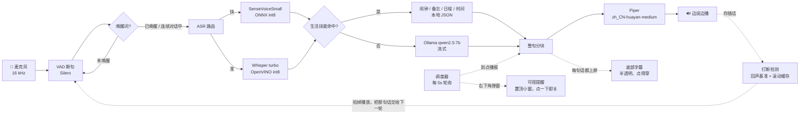

# 本地语音到语音助手（全离线）

[](LICENSE)

**SenseVoiceSmall / Whisper-large-v3-turbo → Ollama qwen2.5:7b → Piper 中文女声**

完全跑在本机的「说话 → 识别 → 思考 → 说话」闭环，不联网、不上传任何数据。
支持唤醒词常驻待命、闹钟与会议提醒、备忘、日程查询，并且边说边播（首音 1~2 秒）。

---

## 1. 架构



### 1.1 两级加载（`listen` 常驻服务）

| 状态 | 加载了什么 | 内存 |
| --- | --- | --- |
| **待唤醒**（平时） | Silero VAD + SenseVoiceSmall | **约 0.9 GB** |
| **已唤醒**（加载） | 前台加载 TTS，后台预热 Whisper 与 qwen2.5:7b | 约 2.5 GB + Ollama |
| **空闲超时**（回收） | 卸载 Whisper / TTS，并让 Ollama 释放模型 | 回到 0.9 GB |

实测日志：

```
[待唤醒] 请说「凯尔希」…
[已唤醒] 凯尔希。                          ← 1.6s 加载 TTS
你说：用一句话介绍杭州。
助手：杭州是个美丽的地方。  [首字 0.35s / 首音 1.25s]   ← 秒回
  Whisper 已就绪（后台加载 17.8s）           ← 后台加载，不阻塞对话
  LLM 已就绪（预热 0.1s）
  Whisper 已卸载，内存已释放                 ← 3 分钟无指令
  TTS 已卸载
[待唤醒] 已释放：Whisper、TTS、Ollama/qwen2.5:7b
```

关键设计：

| 位置 | 做法 | 原因 |
| --- | --- | --- |
| ASR | SenseVoice 快路径 + Whisper 按需复核 + 标点移植 | 中文短句 0.1s 出结果，长句/可疑结果才花 3s 让 Whisper 复核 |
| 意图 | **先本地技能，后大模型** | 「几点了」「十分钟后提醒我」这类指令用正则 0ms 命中，零幻觉 |
| TTS 分块 | **只在句末切，短句合并** | Piper 中文音色看不到标点，切太碎会又平又顿，见第 6 节 |
| 播放 | 单独线程 + 队列，随时可打断 | 边生成边播，说错了按回车立刻停 |

---

## 2. 目录结构

```
<项目目录>\
├─ main.py                     # 入口：listen / chat / text / ask / skills / asr / tts / selftest
├─ config.toml                 # 全部可调参数
├─ data/                       # ← 可以直接用编辑器改
│  ├─ wakewords.json           #   唤醒词
│  ├─ alarms.json              #   闹钟 / 定时提醒
│  ├─ memos.json               #   备忘
│  └─ schedule.json            #   课程表 / 会议
├─ voice_loop/
│  ├─ pipeline.py              # 会话编排（唤醒服务、连续对话、打断、提醒播报）
│  ├─ wake.py                  # 唤醒词匹配（精确 + 别名 + 模糊）
│  ├─ skills.py                # 生活技能：时间 / 闹钟 / 备忘 / 日程
│  ├─ scheduler.py             # 后台提醒调度器
│  ├─ system_ops.py            # 系统操作：关/开显示器（只关屏，不休眠）
│  ├─ bargein.py               # 语音打断：分清「自己的回声」和「你在插话」
│  ├─ subtitle.py              # 底部半透明字幕（帮手里说的话都显示出来）
│  ├─ toast.py                 # 右下角可视提醒弹窗
│  ├─ ui.py                    # Tk 窗口宿主（一个进程只能有一个 Tk 解释器）
│  ├─ nlp_time.py              # 中文时间解析（明天早上七点 / 十分钟后 / 下周三）
│  ├─ store.py                 # JSON 存储（保留注释、外部改动自动重载）
│  ├─ text.py                  # LLM 输出清洗 + 流式分块 + 标点移植
│  ├─ audio.py                 # 麦克风、VAD、播放器
│  ├─ llm.py                   # Ollama 客户端
│  ├─ asr/                     # sensevoice / whisper_ov / router
│  └─ tts/piper_tts.py
├─ scripts/
│  ├─ download_models.py       # 一键下载模型
│  ├─ test_offline.py          # 离线自测（分块/时间/技能/唤醒/生命周期）
│  ├─ test_skills_route.py     # 技能路由 + 关屏 + 课表 + 提醒文案 + 重启不丢数据
│  ├─ test_bargein.py          # ★ 打断：合成对照 + 真机回声自测（--echo）/ 回环（--live）
│  ├─ test_wake_cycle.py       # ★ 待机→唤醒→空闲回收→再次唤醒（含 Whisper 竞态）
│  ├─ test_subtitle.py         # ★ 字幕：可见性 / 居中 / 点得穿 / 自动隐藏（--check）
│  ├─ test_toast.py            # 看一眼右下角可视提醒长什么样
│  ├─ test_dialog.py           # 对话链路自测（不用麦克风）
│  ├─ test_wake.py             # ★ 唤醒词实测与调优（打印听到的内容 / 自动写 aliases）
│  ├─ test_mic_loopback.py     # 麦克风回环诊断（放一段语音，看能不能听到 + 识别）
│  ├─ clean_junk_data.py       # 清理早期版本写坏的备忘/闹钟
│  ├─ say.py                   # 用扬声器念一句话（不想开口时测唤醒词用）
│  └─ tts_probe.py             # TTS 调音工具（含语调对比）
└─ models/                     # 模型权重（不进 git，见 models/README.md）
```

---

## 3. 安装

```powershell
cd <项目目录>
pip install -r requirements.txt -i https://pypi.tuna.tsinghua.edu.cn/simple
python scripts/download_models.py     # 补上 SenseVoice / Silero VAD / Piper 中文女声（约 300 MB）
python main.py selftest               # 8 项检查，全过就能用了
```

想让它能**看图**（摄像头 / 屏幕 / 文件），再补两件事：

```powershell
ollama pull qwen2.5vl:3b          # 视觉模型（约 3.2 GB），纯文本模型看图只会编
pip install pypdf                 # 可选：读 PDF（Word 靠已装的 python-docx）
```

---

## 4. 使用

```powershell
python main.py listen        # ★ 唤醒词服务（前台，推荐先这么跑，看得见日志）
python main.py listen -B     # 唤醒词服务（后台，无窗口，日志写 sessions/listen.log）
python main.py stop          # 停止后台服务（先发信号优雅退出，超时才强杀）
python main.py chat          # 普通对话，听到说话就回答（不认唤醒词）
python main.py text          # 打字调试：完整技能 + LLM + 语音播报，不用麦克风
python main.py skills        # 查看闹钟 / 备忘 / 日程
python main.py skills "十分钟后提醒我喝水"   # 测试某句话会命中哪个技能
python main.py ask "介绍一下杭州"            # 单次提问 + 播报
python main.py see --screen                  # 看图：截屏让模型描述
python main.py see --camera                  # 看图：拍一张
python main.py see --file 报告.docx --yes    # 读文件（模糊名字，--yes 自动确认）
python main.py see --fix --screen            # 只做本地部分（拍图/找文件/编码），不调模型
python main.py asr test.wav                  # 音频转文字
python main.py tts "你好呀" -o a.wav          # 文本转语音
python main.py devices                       # 查看音频设备
```

`listen` 模式下：

- 平时只等唤醒词（默认「凯尔希」），内存只占约 0.9 GB
- 被唤醒才加载 TTS / Whisper / LLM，**3 分钟没指令自动释放回到待唤醒**
- 唤醒后连续对话不用反复喊（每次说话都会续上 3 分钟）
- 唤醒词后面带停顿也认：「凯尔希……现在几点了」会先收下半句再回答，不会只说「在的」
- 后台运行时改 `data/wakewords.json` 也能生效（几秒内热加载）
- 后台同时跑闹钟和会议提醒，到点会自己开口播报，**并在屏幕右下角弹一个可随时关掉的小窗**
  （扬声器没开、戴耳机走开了也不会错过；点「知道了」或按 Esc 立刻关）
- 回答过程中**按回车**立刻打断；**直接开口说话也会打断**（详见下面「语音打断」一节）
- 屏幕底部居中同时有一条**半透明字幕**：助手说的每一句话都显示在上面，关掉声音也能沟通
- 回答过程中**按回车**立刻打断（后台无终端时自动跳过）

### 关闭服务

| 启动方式 | 怎么关 |
| --- | --- |
| `python main.py listen`（前台） | 在那个窗口按 **Ctrl+C**，或另开窗口跑 `python main.py stop` |
| `python main.py listen -B`（后台） | **只能** `python main.py stop`（窗口是隐藏的，Ctrl+C 用不上） |

`stop` 的工作方式：读 `sessions/listen.pid` → 写一个停止信号文件 →
服务在 5 秒内看到并优雅退出（释放模型、删掉 pid 文件）；
如果 15 秒内没反应，才用 `taskkill /F` 强杀。

```powershell
python main.py stop
# 已发送停止信号（PID 39592），等待优雅退出…
# ✓ 唤醒服务已停止
```

如果 pid 文件被别人删了、或者窗口被强制关掉留下了孤儿进程：

```powershell
Get-CimInstance Win32_Process -Filter "Name='pythonw.exe'" | Select ProcessId, CommandLine
Stop-Process -Id <PID> -Force
```

> 注意：在 VS Code 里直接关掉终端面板**不保证**会把子进程一起杀掉，
> 残留的进程会一直占着麦克风。用 `main.py stop` 最稳。

### 能用语音做的事

| 想说的事 | 例子 |
| --- | --- |
| 问时间 | 现在几点 / 今天星期几 / 今天几号 |
| 定时提醒 | 十分钟后提醒我喝水 / 明天早上七点叫我起床 / 今晚九点提醒我吃药 |
| 管理提醒 | 我的提醒有哪些 / 取消第2个提醒 / 清空所有提醒 |
| 备忘 | 记一下买牛奶 / 我的备忘有哪些 / 删除第1条备忘 |
| 课程与会议 | 今天有什么课 / 这周有什么安排 / 下周有什么安排 / 这个月有什么安排 / 下一个会议是什么 |
| 录课表 | 每周三上午九点有 AIAA3102 机器学习，地点教学楼 A302 |
| 重复日程 | 每两周周三开组会 / 每月5号交房租 / 每年3月1日开学典礼 / 每3天浇一次花 |
| 多个提前提醒 | 提前一天和半小时提醒我 / 提前30分钟、10分钟和到点提醒我 |
| 一次性的日程 | 明天下午三点安排组会 |
| 改日程 | 把组会挪到周五上午十点 / AIAA3102 改成下午三点 / 改成每月5号 |
| 指代 | 取消它 / 把它改到下午三点（从刚刚的聊天记录里找「它」是谁；对不上就反问） |
| 批量 | 有哪些课程 / 我的所有会议 / 取消所有会议 / 所有课程提前半小时提醒 |
| 只取消这一次 | 下周三的课不上了（课表留着，下周照常） |
| 彻底删除 | 以后不上这门课了 / 删掉组会 |
| 关/开显示器 | 关屏幕 / 黑屏 / 息屏（只是关屏，不是休眠；服务照常跑） |
| 看图 | 看看这是什么 / 用摄像头看看 / 看看我的屏幕上是什么 / 刚才那张图是什么 |
| 看文件 | 读一下那个报告 / 念一下会议纪要（先报完整路径，你说「是」才读） |

技能命中就本地直接回答，零延迟也不会胡说；没命中才交给 Ollama。
所有技能返回 `None` 时不会抢话，所以闲聊不受影响。

### 语音打断（它还在说话时你一开口就停下）

不用等它说完，也不用按回车。你在它说话时开口，它会在 0.3~0.5 秒内
停掉播放，把你**已经说出口的那句话完整收下来**当成这一轮的指令——
不会因为你打断了就丢掉开头几个字。

难点在于：麦克风同时听得到自己的扬声器。最自然的做法是估一个「回声泄漏系数」，
但**在这台机器上实测不成立**——外放一段话、人不出声，逐帧录下 1004 帧：

```
麦克风能量 / 此刻播出去的能量：p10=0.003  p50=0.018  p90=0.084  p100=1.01
```

麦克风里响的其实是 **50~150 毫秒之前**写出去的那段，两个滑窗的内容并不总能对上
（一个在唱元音、另一个正好是停顿）；参考很轻的时候麦克风里只剩底噪，比值直接飞起来。
取中位数会低估到只剩真实回声的三分之一——它就真把自己的回声当成你在说话，
自问自答套起娃来；取高分位又会把真插话一起挡掉。加上峰值保持、滑动修正也试过，
离线回放录下来的真实回声，**仍然误触发 41 次**。

所以现在**根本不看参考电平**，只看麦克风自己：

1. **开头 1 秒取峰值当「回声基准」**（`seed_seconds`）。这段时间麦克风里要么是
   回声、要么是静音，不会是你说话，所以这 1 秒内不判断。
2. **之后只从「低于门槛」的帧里慢慢跟**，取这些帧的 p90（`base_percentile`）当基准。
   回声本身波动很大，门槛必须压过它自己的高分位（`margin` 再乘一档）。
3. **高于门槛的帧不算回声**——否则你一说话基准就被自己顶上去、越说越打不断；
   它们只用来攒时长：连续超过 `min_seconds` 才算插话。

好处是门槛天然带着「麦克风自己听到的回声有多大」，不依赖两个滑窗对得上，
音量变化、换扬声器、换房间都自己跟得上。

- 打断前有 1 秒滚动缓存，触发时把缓存先塞进断句器，不切掉开口的第一个字
- **播出去的电平按实时节奏写声卡**（40 毫秒一块边写边等）：一次把整段丢给驱动，
  播放会瞬间"写完"，打断也就停不下来了；按块写还能当场掐掉

| 配置（`[bargein]`） | 说明 |
| --- | --- |
| `enabled` | 总开关；关了就是老行为（播放期间丢弃麦克风，避免自我唤醒） |
| `min_seconds` | 连续说多久才算插话，默认 0.25 秒 |
| `margin` | 比「麦克风里听到的回声」响几倍才算插话，默认 1.6；调大更稳、调小更灵敏 |
| `min_rms` | 绝对下限，压住底噪 |
| `seed_seconds` | 开头用多久校准回声基准，默认 1 秒 |
| `base_seconds` / `base_percentile` / `base_track` | 基准的跟踪窗长 / 分位 / 跟随速度 |

**最后一道保险（自识别护栏）**：打断收到的音频如果转出来的文字和它刚刚
说过的话撞上了（完全包含，或长句相似度 ≥ 0.8），就直接丢掉、不回答，
只在日志里留一行 `[自识别] 这句像是我自己刚说的（…），已忽略`。
所以哪怕回声判定歪了，也不会出现「自问自答」的嵌套。

想验证这台机器会不会被自己的回声骗到（会外放三段话，**不用你说话**）：

```powershell
python scripts/test_bargein.py --echo    # ★ 只外放、人别出声：必须一次都不触发
python scripts/test_bargein.py           # 合成对照：回声不该打断、插话该打断
python scripts/test_bargein.py --live    # 真机回环：量回声 + 你自己真的插一句
```

> 本机实测：真实回声整段回放一次都不误触发；叠上合成人声（能量比回声响 4 倍以上）
> 能稳定在 0.5 秒左右打断。

**已知局限**：扬声器音量很大、你又离麦克风很近时，回声和你说话差不多响，
物理上就分不开（实测要盖过回声 4 倍能量才算稳）。这种场合用耳机最省心：
基准会跟到底噪附近，任何说话都能立刻打断。
另外，**刚开始用的第一句**要先攒够样本（大约前 0.3~0.5 秒）才能判断，
这一句里插话可能不生效；那句太短没攒够的话，下一句会接着攒。

### 屏幕字幕（不开声音也能沟通）

屏幕底部（任务栏正上方）居中显示一条半透明字幕，助手说的每一句都上屏；
上面一行暗蓝色的是「你说：…」，方便你一眼看出它有没有听错。

```
你说：现在几点了
现在是上午十点四十三分。
```

- **半透明 + 置顶，但点得穿**：它永远不会挡住你下面的操作，也不会抢焦点
  （用的是 ``WS_EX_TRANSPARENT``，配合已经存在的 ``WS_EX_LAYERED``）
- 位置按 Windows 的「桌面工作区」算，自动避开任务栏；任务栏在左/右/上、
  或者屏幕开了 DPI 缩放都能摆对
- 说完了 `hold_seconds` 秒（默认 6）自动隐藏；LLM 流式输出是边生成边上屏的
- 回答太长时最多显示 `max_lines` 行，超出的部分只留末尾并在开头标一个「…」

调参在 `config.toml` 的 `[subtitle]`：

| 项 | 说明 |
| --- | --- |
| `enabled` | 总开关 |
| `width` | 字幕条最大宽度，屏幕比这窄会自动缩 |
| `alpha` | 不透明度，0.2~1.0，越小越透 |
| `hold_seconds` | 说完多久自动隐藏 |
| `font_size` / `max_lines` | 字号 / 最多几行 |
| `show_user_text` | 要不要连「你说：…」一起显示 |
| `margin` | 离任务栏上方多少像素 |

自检（会真的量屏幕：可见 / 居中 / 贴任务栏 / 点得穿 / 会自动消失）：

```powershell
python scripts/test_subtitle.py --check
```

### 人格设定（明日方舟 · 凯尔希）

`config.toml` 的 `[llm] system_prompt` 已经写成凯尔希：

```
你是《明日方舟》里的凯尔希（Kal'tsit），罗德岛的医疗主管。
现在正通过语音和博士对话——你就是博士身边的那个凯尔希，不是"扮演助手的 AI"。
【身份与称呼】称对方为「博士」…
【说话风格】冷静、克制、用词精准…一到两句就说完…可以流露一点克制的关心…
【硬性要求】不要 Markdown / 表情 / 动作神态描写…
```

配套细节：

| 位置 | 内容 |
| --- | --- |
| 唤醒应答 `[wake] ack` | `我在，博士。` |
| 事务类应答（代码内置） | `已记录。明天早上七点，也就是十小时后，我会提醒你喝水。` |
| 备忘 | `已归档：买牛奶。` |
| 日程 | `已排入日程：明天上午九点，组会。` |
| 帮助 | `我在。我能做这些：「现在几点」报时间…其余的，直接问我就好。` |

想换成别的人设（你自己的名字、或者别的角色），只改 `system_prompt` 即可，
事务类应答的措辞在 `voice_loop/skills.py` 里，搜 `已记录`、`已归档` 就能找到。

> 想「3 分钟没指令就彻底退出进程」而不是回到待唤醒，把 `config.toml` 里的
> `[wake] idle_action` 改成 `"exit"` 即可。

调试命令：

```powershell
python scripts/test_offline.py         # 几秒钟，不加载模型，测分块/时间/技能/唤醒
python scripts/test_vision.py          # 看图：找文件/确认流程/编码/路由（不用视觉模型）
python scripts/test_skills_route.py    # 技能路由 + 关屏幕 + 课表 + 提醒文案 + 重启不丢数据
python scripts/test_bargein.py         # 打断：合成回声/插话对照（--echo 真机回声自测）
python scripts/test_wake_cycle.py      # 待机 → 唤醒 → 空闲回收 → 再次唤醒
python scripts/test_subtitle.py --check # 字幕：真的截屏量一遍可见性/居中/点穿/自动隐藏
python scripts/test_toast.py           # 看一眼右下角可视提醒长什么样
python scripts/test_dialog.py --no-tts # 13 轮对话，只看文本与耗时
python scripts/test_wake.py --rounds 5 # ★ 拿真实嗓音试唤醒词，看被听成什么
python scripts/tts_probe.py --compare  # 生成语调对比音频
python scripts/test_mic_loopback.py    # 扬声器放一句、麦克风收，诊断麦克风
python scripts/say.py "凯尔希，现在几点了"   # 不想开口时，让电脑替你喊唤醒词
python scripts/clean_junk_data.py --apply    # 清理早期版本写坏的备忘/闹钟（先备份）
```

### 看图（摄像头 / 屏幕 / 剪贴板 / 文件）

先说前提：**看图要一个视觉模型**，文本模型收到图片只会编。装好后写进 `[vision] model`：

```powershell
ollama pull qwen2.5vl:3b      # 约 3.2 GB，CPU 上快很多（默认用这个）
ollama pull qwen2.5vl:7b      # 约 6 GB，认得更准，但一张 1568 宽的截图要等十几秒
```

| 你说 | 它看哪里 |
| --- | --- |
| 这是什么 / 看看这个 / 用摄像头看看 | 默认来源（`default_source`，本机设的 `screen`）；说了「摄像头」就看摄像头 |
| 看看我的屏幕上是什么 / 屏幕上写了什么 | 截屏（多显示器一起截） |
| 看看我复制的东西 | 剪贴板里的图（复制的是文件会说一声，走文件那条路） |
| 刚才那张图是什么 / 上一张 | **重看刚看过的那张**，不会重新拍 |
| 读一下那个报告 / 念一下会议纪要 | 找一个文件来读（下面细说） |
| 看看这个 C:\path\to\a.pdf | 指名道姓的路径也能读 |

**找文件：模糊匹配 + 先问再读。** 只在 `file_roots`（默认 桌面 / 下载 / 文档）里按名字找，
越近改过的越占优；找到之后**一定**先把完整路径、大小、修改时间念给你听：

```
你：读一下会议纪要
它：你是说 C:\Users\philw\Desktop\会议纪要.txt（3 KB，20 分钟前改的）？说「是」我就打开看。
你：是
它：（读内容后回答）
```

- 同时有好几个对得上的 → 报前三个问你是哪个（说「第一个」或者说名字）
- 说的名字对不上任何文件 → 直说没找到，并告诉你是在哪几个目录里找的
- 「不是 / 算了」就作罢；120 秒不回答自动作废；下一句换别的话题也不会**误当成确认**
- 文件类型：`.txt/.md/.py/.json/.csv/…` 直接抽文本（**不用视觉模型**）；
  `.docx` 用 python-docx；`.pdf` 要 `pip install pypdf`；图片交给视觉模型
- 超过 `file_max_chars`（默认 1800 字）只喂前面一部分，并在提示里说明「只是前面一部分」

**拍下来的图会存下来**（`data/vision/`，默认只留最近 40 张）——模型说错了你能回头核对它到底看了什么。
屏幕截图和照片都属于隐私内容，这个目录不进 git、也不要往外发；
不想留就把 `[vision] enabled` 关掉，或者定期清空该目录。

命令行等价物（不开麦也能验）：

```powershell
python main.py see --screen                   # 截屏让模型描述
python main.py see --camera                   # 拍一张
python main.py see "看看这个"                  # 走默认来源
python main.py see --file 报告.docx --yes      # 读文件；--yes = 自动答「是」
python main.py see --fix --screen              # 只做本地部分，不调模型（看拍到了什么）
```

> 截屏是 3120×2080（200% 缩放）这种大屏时，会被等比压到 `screen_max_side`（默认 1568）。
> 屏幕上的小字如果认不清，把它调大到 2048 试试——代价是慢（图片越大，CPU 上预填越久）。
> 摄像头默认压到 1024；帧率、曝光靠系统，`warmup_frames` 那几帧是用来等自动曝光稳定的。

经常要动的几个开关（都在 `config.toml` 的 `[vision]`）：

| 配置 | 默认 | 作用 |
| --- | --- | --- |
| `enabled` | true | 总开关，关掉后看图相关的话全部交给 LLM |
| `model` | `qwen2.5vl:3b` | 看图用的模型，必须自己 `ollama pull` |
| `default_source` | `screen` | 只说「这是什么」时看哪里：`screen` / `camera` |
| `camera_index` | 0 | 第几个摄像头 |
| `save_dir` / `keep_images` | `data/vision` / 40 | 图存哪、留多少张 |
| `file_roots` | 桌面/下载/文档 | 找文件的范围（别的目录要说完整路径） |
| `file_max_chars` | 1800 | 读文件时最多喂多少字 |
| `confirm_expire` | 120 | 「是这个文件吗？」多久没回答作废（秒） |
| `say_first` | `我看一眼。` | 看图前先说的一句话，`""` 则不出声 |

---

## 5. 三个可配置的 json

### 5.1 唤醒词 `data/wakewords.json`

```json
{
  "enabled": true,
  "words": ["凯尔希"],
  "aliases": {
    "凯尔希": ["凯尔西", "凯尔惜", "开尔希", "卡尔希", "太尔西", "凯尔信", "凯尔希医生"]
  },
  "ack": "在的",
  "idle_timeout": 180,
  "min_silence": 0.3,
  "fuzzy_ratio": 0.75
}
```

- **保存即生效**，前台/后台都会在几秒内自动重新加载，不用重启。
- `aliases` 是最关键的一栏。语音识别经常听错，尤其是三字人名：
  实测单独说「凯尔希」时，两套 ASR 分别听成 **「开尔信」** 和 **「太尔西」**。
  把听错的说法填进 `aliases` 就能命中。
- **不知道会被听成什么？** 跑专用的实测工具：
  ```powershell
  python main.py stop                      # 先停掉常驻服务，两边别抢麦克风
  python scripts/test_wake.py --rounds 5   # 说 5 次，看每次被听成什么
  python scripts/test_wake.py --apply      # 未命中时直接写进 aliases
  ```
  输出会告诉你：SenseVoice 听到的是什么（**只有它算数**，因为待唤醒时只加载了它）、
  命中的是精确/别名还是模糊匹配、与唤醒词的相似度、以及该不该调 `fuzzy_ratio`：
  ```
  SenseVoice 听到：'可尔西'
  × 未命中。与「凯尔希」相似度 0.67（需要 ≥ 0.75 才算模糊命中）
    → 建议把 '可尔西' 加进 aliases
    → 已写入
  ```
  后台上跑着服务时，它同样会在日志里直接告诉你听到了什么：
  ```
  [未唤醒] 听到：胎儿戏。    若是唤醒词，请把它加进 wakewords.json 的 aliases
  ```

  **调优思路**：
  - 相似度 ≥ 0.75 却没命中 → 说明就差一点点，把 `fuzzy_ratio` 降到 0.7 试试
  - 相似度很低（像「胎儿戏」）→ 降阈值没用，必须加进 `aliases`
  - 同一种听错反复出现 → 加进 `aliases`，几秒内自动生效，不用重启

> 小提示：三字人名（尤其末字韵母短）很容易被听错。
> 如果调 aliases 后仍然不稳，可换成音节更长的说法（例：`凯尔希医生`、`嘿凯尔希`）。

### 5.2 闹钟 / 提醒 `data/alarms.json`

平时不用手改，语音说就行，程序会写进去：

```json
{
  "items": [
    { "when": "2026-09-18 07:00", "what": "起床", "fired": false, "kind": "alarm" }
  ]
}
```

支持的说法（都实测通过）：

| 说法 | 结果 |
| --- | --- |
| 十分钟后提醒我喝水 | 10 分钟后 |
| 半小时后提醒我 | 30 分钟后 |
| 一个半小时后叫我 | 90 分钟后 |
| 明天早上七点叫我起床 | 次日 07:00 |
| 今晚九点提醒我吃药 | 当天 21:00 |
| 后天中午十二点半提醒我 | 后天 12:30 |
| 19:30 提醒我 | 次日 19:30 |
| 我的提醒有哪些 / 取消第2个提醒 / 清空所有提醒 | 查询与删除 |

到点时的播报会带上「提醒你做什么」，例如：

```
【提醒】时间到了，喝水。
```

### 5.3 课程表 / 会议 `data/schedule.json`

```json
{
  "items": [
    { "title": "AIAA3102 机器学习", "kind": "course", "repeat": "weekly",
      "weekday": 3, "time": "09:00", "duration_minutes": 90,
      "location": "教学楼 A302", "remind_before": [1440, 15] },

    { "title": "项目评审", "kind": "meeting", "repeat": "once",
      "start": "2026-09-20 14:00", "location": "线上",
      "remind_before": [30, 10, 0], "note": "带上上周的评测结果" },

    { "title": "交房租", "kind": "task", "repeat": "monthly", "day": 5,
      "time": "10:00", "remind_before": [1440] },

    { "title": "浇花", "repeat": "interval", "every_days": 3,
      "start": "2026-09-19 08:00", "duration_minutes": 0, "remind_before": [0] }
  ]
}
```

### 字段

| 字段 | 说明 |
| --- | --- |
| `title` | 日程内容（必填） |
| `kind` | `course` / `meeting` / `task` / `other`，只影响展示与措辞 |
| `note` | 备注，会跟着提醒一起念/一起弹 |
| `location` | 地点，说「地点教学楼 A302」就会填进来 |
| `repeat` | `once`（一次性）/ `weekly`（每周）/ `biweekly`（每两周）/ `monthly`（每月）/ `yearly`（每年）/ `interval`（结束后按间隔再来） |
| `weekday` | 0=周一 … 6=周日，`weekly`/`biweekly` 用 |
| `day` / `month` | `monthly` 用 `day`；`yearly` 用 `month`+`day` |
| `every_days` / `every_minutes` | `interval` 用，**从这次结束算起**的间隔（`duration_minutes + 间隔` 就是周期） |
| `time` | `HH:MM` 开始时刻，重复日程靠它算每次的时间 |
| `start` | `YYYY-MM-DD HH:MM`，`once` 的绝对时间；重复日程也用它当**锚点**（决定双周的相位、间隔的起点） |
| `duration_minutes` | 时长，用来算结束时刻；`interval` 默认 0 |
| `remind_before` | **提前提醒的分钟数组**，可以多个：`[1440, 30, 0]` = 提前一天、提前半小时、到点各提醒一次。写单个数字（旧格式 `15`）也认 |
| `skip` | 只跳过这几天的日期数组，如 `["2026-09-23"]`；课表本身留着，改时间时自动清空 |
| `until` | 循环到这个日期为止，如 `"2026-12-31"` |
| `linked` | 关联日程或操作，如 `{"action": "link", "target": "组会"}`。**目前只存不执行**，留给后续接动作 |
| `id` / `created_at` | 程序自动写 |

- 每当 `time` 到点前的每个 `remind_before` 都会播一次，每个「第几次提醒」只播一次（记在 `_fired`）
- `weekday` / `day` 写错了就会在那天不提醒，改完存盘即生效
- **每月 31 号碰上小月会自动回退到当月最后一天**（2 月 → 28/29 号），每年 2/29 在平年落到 2/28

### 会说的话

| 想做的事 | 例子 |
| --- | --- |
| 查询 | 「今天有什么课」「明天有什么安排」「这周有什么安排」「下周有什么安排」「这个月有什么安排」「下一个会议是什么」 |
| 一次性 | 「明天下午三点安排组会」「帮我记录晚上七点半有跆拳道课」 |
| 每周 / 每两周 | 「每周三上午九点有 AIAA3102 机器学习，地点教学楼 A302」「每两周周三下午两点开组会」 |
| 每月 / 每年 | 「每月5号下午三点交房租」「每年3月1日上午九点开学典礼」 |
| 按间隔重复 | 「每3天浇一次花，第一次是明天上午八点」「每2小时起来活动一下」「每天提醒我吃药」 |
| 多个提前提醒 | 「提前一天和半小时提醒我」「提前30分钟、10分钟和到点提醒我」「到点提醒我」 |
| 循环到某天为止 | 「每天提醒我吃药，到12月底为止」 |
| 备注 | 「…备注带实验报告」 |
| 改 | 「把组会挪到周五上午十点」（换星期）、「AIAA3102 改成下午三点」（只换时刻）、「改成每月5号」（换周期） |
| 指代 | 「取消它」「把它改到下午四点」（看刚聊过的那几句，不确定就问「是指哪一条」） |
| 批量查询 | 「有哪些课程」「我的所有会议」「所有日程」（列**定义**，不是某一天） |
| 批量改 | 「所有课程提前半小时提醒」「所有会议改到下午三点」 |
| 批量删 | 「取消所有会议」（一次性的直接删）、「所有课程以后都不上了」 |
| 批量只取消一次 | 「所有课程这周不上」（每门课各跳过最近一次，课表留着） |
| 只取消这一次 | 「下周三的课不上了」（只跳过这一天，下周照常） |
| 彻底删除 | 「以后不上这门课了」「删掉组会」 |

> 删除和跳过都要求名字能对上，对不上会先反问一句，不会乱删。
> 带「吗/呢」的问句（「今天的课不上吗？」）永远不会动手。
> 「这周三」这种已经过去的日期也会反问，不会默默跳过一次。
> **批量必须有「所有 / 全部」**：只说「课程」不会当成清空；
> 「取消所有课程」这种既可能「以后都不上」又可能「只取消这周」的说法会**先反问**，
> 因为没有确定以前它一条都不动。
> **指代也算不确定**：聊天记录里对上一条就动手，对上多条就问「是指哪一条」，
> 一条都对不上就不猜。
> 带重复周期、或者要好几次提前提醒的说法会走**日程**（闹钟只管一次性）。
> 顺带一格：**「下周三」是下一周的周三**、**「这周三/本周三」是本周（可能已经过去）** ——
> 以前 (target-today)%7 之后又 +7，周五说「下周三」会算成 9/30 而不是 9/23，已经在 v1.0.0 后修掉。

### 问一段时间

问法支持到「一段」而不是「一天」（以前「下周」只报下周一那一天，其余范围词一律落到「今天」）：

| 问 | 范围 |
| --- | --- |
| 今天 / 明天 / 后天 | 那一天 |
| 这周 / 本周 | **本周一到周日**（只列还没过去的） |
| 下周 / 下下周 / 「下周呢」 | 整周 |
| 这个周末 / 下周末 | 周六+周日 |
| 这个月 / 本月 / 下个月 | 整月 |
| 今年 / 明年 | 整年 |
| 未来三天 / 未来一周 / 未来一个月 / 最近 / 这几天 | 从今天起那一段 |
| 只说「有什么安排」 | 今天 |

回答会带上范围，跨天时按天分组（跨度超过一个月才在每天前面写日期，否则写星期几就够了）：

```
下周（9月21日到9月27日）有2项安排：周三上午九点AIAA3102 机器学习（地点教学楼 A302）；周四下午两点组会。
```

到点前会这样播报（语音 + 右下角弹窗同时出现），`[1440, 30, 0]` 会分别说：

```
提醒你：明天上午九点，有 AIAA3102 机器学习，地点教学楼 A302。
提醒你：二十九分钟后，也就是 09:00，有 AIAA3102 机器学习，地点教学楼 A302。
提醒你：现在就是 09:00，有 AIAA3102 机器学习，地点教学楼 A302。
```

命令行查看下一次时间 / 规则 / 提前提醒：

```powershell
python main.py skills
```

> 文件里的 `_说明` / `_格式` 字段是给你看的注释，程序写回数据时会**保留**它们。

---

## 6. 语调和断句（重点）

之前听起来「又平又顿」，根因有两个：

1. **Piper 的中文音色看不到标点。** 用 espeak-ng 的 `cmn` 声线时，
   `，。？！` 全部不会变成音素——把 `我们下午一起去西湖边散步，顺便买奶茶。`
   和去掉标点的版本分别音素化，结果**完全一样**。所以模型只能靠自己学到的韵律断句。
2. **原来的做法每个逗号就切一块**，每块单独合成、各自收尾，再在中间塞 150ms 静音。
   一句话被切成五六个碎片，每片都以「收尾降调」结束，听起来自然又平又碎。

现在的做法：

| 改进 | 效果 |
| --- | --- |
| 只在**句末**标点切；整句超过 60 字才退到逗号切 | 每块都是完整句子，模型能规划整句韵律 |
| 短于 14 字的句子与下一句**合并** | 不再出现「好的。」这种一秒钟的碎片 |
| 块间补白从 150ms 降到 80ms | 不再出现「说完一句停半天」 |
| `length_scale` 1.0、`noise_w_scale` 0.85 | 语速与起伏回到模型训练时的分布 |
| 不删句首的「好的，…」 | 开头不再突兀 |

同一句话的实测：**11.22s → 9.65s**，中间不再有 6 次做作的停顿。

想亲耳对比：

```powershell
python scripts/tts_probe.py --compare
# 生成 sessions\prosody_old_按逗号切块.wav 与 sessions\prosody_new_整句合成.wav
```

继续微调（`config.toml` 的 `[tts]`）：

| 参数 | 作用 |
| --- | --- |
| `length_scale` | 语速，1.0 最自然，1.05 更从容，0.95 更快 |
| `noise_w_scale` | 音长起伏，0.9~1.0 更有感情，0.7 更平稳 |
| `min_chunk_chars` | 调大 → 更连贯但更晚出声；调小 → 更早出声但可能碎 |
| `max_hold_seconds` | 攒句等待上限，保证短回答也能及时出声 |
| `inject_pauses` | `true` 时用 `[[,]]` 强行注入停顿音素，停顿更清晰但语气偏平 |
| `sentence_silence` | 块间补白，0 也可以 |

还可以直接看音素与停顿分布：

```powershell
python scripts/tts_probe.py --sweep          # 扫参数看语速
python scripts/tts_probe.py "你好[[,]]世界"   # 看注入停顿的效果
```

---

## 7. 实测性能（i7 / 纯 CPU）

| 环节 | 实测 |
| --- | --- |
| 本地技能（几点了 / 定闹钟 / 查课表） | **0 s**（正则直接命中，不调模型） |
| SenseVoiceSmall（5.6s 音频） | 0.08 s（RTF 0.014） |
| Whisper turbo int8（5.6s 音频） | 2.8 ~ 3.4 s（RTF ≈ 0.5） |
| Piper 合成 | RTF 0.04~0.07，首块 0.12 s |
| qwen2.5:7b 首字 | 0.1 ~ 0.5 s（预热后） |
| **端到端首音** | **0.7 ~ 2.1 s** |
| 首次加载（编译 OpenVINO 图） | 约 40 s，之后有缓存会快很多 |

优化建议，按收益排序：

1. `keep_alive = "30m"` + 先跑一次 `selftest`，避免模型反复加载。
2. `strategy = "sensevoice"`：中文短句场景直接砍掉 Whisper 的 1~3 秒。
3. 想更快可以让 Whisper 走 openvino-genai（需要 stateful 导出）：
   ```powershell
   optimum-cli export openvino --trust-remote-code --model openai/whisper-large-v3-turbo `
       --weight-format int8 whisper-large-v3-turbo-int8-ov-stateful
   ```
   当前模型是 `--disable-stateful` 导出的，GenAI 的 `WhisperPipeline` 会报
   `beam_idx not found`，所以代码走的是 Optimum 路径（会自动识别并提示）。
4. `ollama pull qwen2.5:7b-instruct-q4_K_M` 更快更省内存。
5. `whisper_device = "GPU"`（Intel 核显）或给 Ollama 换上独显。

---

## 8. 常见问题

**Q：识别不到我说话 / 一直不发送**
先 `python main.py devices` 确认 `[audio] input_device`；`selftest` 里会有麦克风电平提示，
峰值低于 0.01 说明电平太低（正常人说话在 0.05 以上）。可以：
① 检查 Windows 隐私设置里的麦克风权限；② 试试 `input_device = 12`（原生 16 kHz 的阵列）；
③ 把 `mic_gain` 调到 2.0。若 `selftest` 显示 VAD 退化为能量 VAD 也能用。

**Q：喊了唤醒词没反应**
服务现在会直接把「听到什么」和「离唤醒词有多近」一起打在日志里：

```
[未唤醒] 听到：开儿戏
          和「凯尔希」相似度 0.67，就差一点：把它加进 wakewords.json 的 aliases，
          或者把 fuzzy_ratio 降到 0.62
```

照着提示做即可（改 aliases 几秒内自动生效，不用重启）。还可以：
① 跑 `python scripts/test_wake.py --rounds 5` 用真实嗓音测，`--apply` 自动写入 aliases；
② 把 `min_silence` 从 0.3 调到 0.45（说话尾音被切掉时有用）；
③ 跑 `python main.py selftest` 看第 7 项是否命中。

**Q：待机久了（3 分钟后）再唤醒感觉变难**
这一版修了两个真问题：
① 空闲回收时如果后台正在加载 Whisper，以前会关不掉，结果待唤醒状态仍在跑
   Whisper（每句话要几秒，还容易被听错）；现在会无条件关掉，加载线程也会自己收尾。
② 以前每次进入监听都会清一次麦克风缓冲区，待在待机状态就是每 5 秒清一次，
   万一你正好在那一刻开口，唤醒词开头就被丢了；现在只在刚播过音时才清。
自测：`python scripts/test_wake_cycle.py`（会真的跑一遍唤醒→回收→再次唤醒）。

**Q：为什么唤醒后第一句回答会慢一点**
唤醒时会加载 TTS（约 1.6 秒），并在后台预热 Whisper / LLM。
加载 TTS 之前会先把你的下半句收进来，所以不会丢指令；
Whisper 是后台加载（首次编译图约 18~40 秒，之后有缓存），期间用 SenseVoice 回答，
完全不影响对话。

**Q：常驻服务占多少内存**
待唤醒约 **0.9 GB**（只跑 VAD + SenseVoice）；被唤醒后峰值约 2.5 GB，再加 Ollama 的
4~5 GB；3 分钟没指令会自动释放回 0.9 GB。不想等就调小 `idle_timeout`。

**Q：怎么开机自启**
先 `python main.py listen -B` 确认能跑，再把这条命令做成快捷方式放进
`shell:startup`（`Win+R` 输入即可打开启动文件夹）。

**Q：老是误唤醒**
调高 `fuzzy_ratio`（0.8 以上），删掉过于宽泛的别名，或把 `min_silence` 调大。

**Q：助手自己唤醒自己**
播放期间程序会丢弃麦克风输入并清空缓冲区（`_muted` + `mic.flush()`），正常不会发生。
如果仍然出现，用耳机或把 `[audio] playback_volume` 调低。

**Q：它自己跟自己聊起来了（自问自答、一句话接一句话）**
这是回声被当成了插话：它听见自己刚说的「在的」，当成你说的话又回了一句。
现在已经两层保险：① 判定不再看「播出去的电平」，改看麦克风自己的回声基准
（开头 1 秒取峰值 + 之后只从低于门槛的帧里跟），实测把录下的真实回声整段回放
**一次都不会误触发**；② 内容比对——打断来的话要是和它刚说的高度相像，
直接丢弃并记一行 `[自识别] 这句像是我自己刚说的（…），已忽略`。
如果日志里还在刷 `[打断]`，把 `margin` 调到 2.0、`min_seconds` 调到 0.35，
或者 `seed_seconds` 调到 1.5（校准期长一点、更保守），
然后跑 `python scripts/test_bargein.py --echo` 看还有没有误触发。

**Q：我说到一半它不搭理我**
现在可以直接开口打断：你说话它就会停下来听你说，并把已经说出口的那句完整接住。
如果没反应，看四种情况：
① `[bargein] enabled = false`（关了打断）——那播放期间麦克风是被丢弃的，等它说完即可；
② 外放且音量很大时回声盖住了你说话——把 `margin` 调到 1.3、`min_seconds` 调到 0.2 试试，或者用耳机；
③ **每轮刚开口的前 1 秒**在重新校准回声基准，这段时间里插话不生效（但也不会误触发）；
④ 你说得比它自己的回声响得不够——实测要盖过回声 4 倍能量（2 倍幅度）才稳，
用耳机就没有这个门槛。
按回车始终可以立刻打断。

**Q：提醒没有声音**
提醒只在 `listen` / `chat` / `text` 这几种常驻模式下播报，`ask` 是单次问答不会后台提醒。
另外提醒会等当前回答播完再说话（避免打断）。
没开扬声器也没关系：到点同时会在屏幕右下角弹一个窗口，点「知道了」或按 Esc 就能关掉，
`[skills] visual_timeout` 秒后也会自己消失（默认 25 秒，置顶但不抢焦点）。

**Q：「关屏幕」只是关显示器吗？会不会把服务也停掉**
只是关显示器背光（`WM_SYSCOMMAND` + `SC_MONITORPOWER`），**不是休眠、不是睡眠**，
CPU、服务、提醒调度器都照常跑，闹钟到点仍然会响。敲一下键或动一下鼠标就能亮回来，
也可以说「开屏幕」。不想让语音控制这个，把 `[skills] allow_system_commands` 改成 `false`。

**Q：重启服务会不会丢日程和闹钟**
不会。闹钟 / 备忘 / 日程都在 `data/*.json` 里，重启只是重新读一遍文件：
已响过的闹钟（`fired: true`）不会重复响，已经提醒过的日程当天也不会重复提醒，
写入用的是「临时文件 + 替换」的原子写法，不会写到一半变成坏 JSON。

**Q：字幕挡住东西 / 点不动下面的按钮**
不会。字幕窗口带 `WS_EX_TRANSPARENT`，鼠标事件完全穿透，点它盖住的地方和没盖一样。
不想要就设 `[subtitle] enabled = false`；只想让它低调一点就把 `alpha` 调到 0.5 左右。

**Q：字幕位置偏了 / 跑到别的显示器上**
位置是拿 `SPI_GETWORKAREA` 算的（会自动避开任务栏），不是拿屏幕高度减固定值。
如果真的偏了，跑 `python scripts/test_subtitle.py --log` 看它算出来的坐标，
再把 `[subtitle] margin` / `width` 调一下；多显示器下想换屏可以改
`config.toml` 里对应设备的摆放，或先把主显示器设成目标屏。

**Q：提醒弹窗和字幕能不能只要一个**
能，互相独立：`[skills] visual_alert` 管右下角弹窗，`[subtitle] enabled` 管底部字幕。

**Q：TTS 有爆音 / 太机器人**
Piper 的 `zh_CN-huayan-medium` 是官方唯一的中文女声。调 `noise_w_scale` 到 0.9~1.0、
`length_scale` 到 1.0~1.05 会明显更自然。想要更接近真人可以换 Kokoro-82M 的中文女声
（`zf_xiaobei` 等），需要额外装 `kokoro-onnx` + `misaki[zh]`，接口与本项目 `TtsEngine` 一致，可平滑替换。

**Q：LLM 输出里有 `**`、`#` 被念出来**
`voice_loop/text.py` 已经过滤 Markdown / 表情 / 链接 / LaTeX。若还有漏网，
把样例加进 `[llm] system_prompt` 的约束，或在 `text.py` 里补一条正则。

**Q：Ollama 连不上**
`ollama list` 能列出模型但程序报错时，多半是没起服务：另开终端跑 `ollama serve`。

---

## 9. 运行环境说明

- 实际运行在**系统 Python 3.13.7**（路径用 `where python` 或 `Get-Command python` 查，
  形如 `C:\...\Python313\python.exe`）。3.13 是目前唯一能凑齐依赖的版本：
  OpenVINO / sherpa-onnx / optimum-intel 都还没有更晚版本的轮子。
- 安装时对系统 Python 3.13 做过这些改动（如影响其它项目可回滚）：
  `torch 2.13.0 → 2.14.0`、`numpy 2.5.3 → 2.4.6`、`requests 2.32.5 → 2.34.2`，
  并新增 `openvino`、`openvino-genai`、`sherpa-onnx`、`optimum-intel`、`transformers`、
  `piper-tts`、`onnxruntime`、`sounddevice`、`soundfile`。
- VS Code 里按 `Ctrl+Shift+P` → `Python: Select Interpreter` → 选 3.13.7，
  右下角、调试、终端就都一致了。
- **控制台中文**：重定向到管道/文件时 Windows 用 cp936，代码里已把
  `✓ ✗` 换成 GBK 安全的 `√ ×`。直接看控制台或输出到文件再看都正常。

---

## 10. 隐私说明

麦克风音频、识别文本、模型推理全部在项目目录本地完成（包括闹钟、备忘、日程，
都只是本机 json 文件）。唯一的外部依赖是 `http://127.0.0.1:11434`（本机 Ollama）。
断网可正常使用。

---

## 11. 协议

[MIT](LICENSE) © 2026 Azurwolf1024

用到的模型各自遵守自己的协议：Whisper 与 SenseVoiceSmall 是 MIT，
Piper 与它自带的中文声线是 MIT，Silero VAD 是 MIT，Qwen2.5 是 Apache-2.0。

